# 端到端模型及时空联合交互优化后处理

## 1. 背景与问题分析
### 1.1 Rule-based 规划局限性
**规则驱动**的决策-规划架构，其核心局限性在于：

#### 1.1.1 规则覆盖不全，长尾场景失效
+ 规则由人工枚举编写，无法覆盖所有驾驶场景的组合爆炸
+ 每新增一条规则可能与已有规则冲突，系统复杂度随场景数指数增长
+ 典型场景：超长异型车

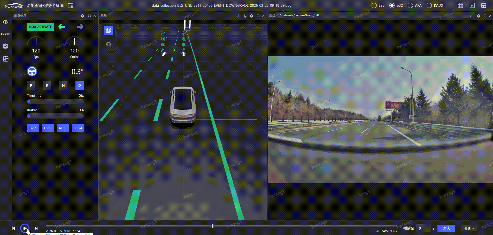

+ 典型场景：倒地水马

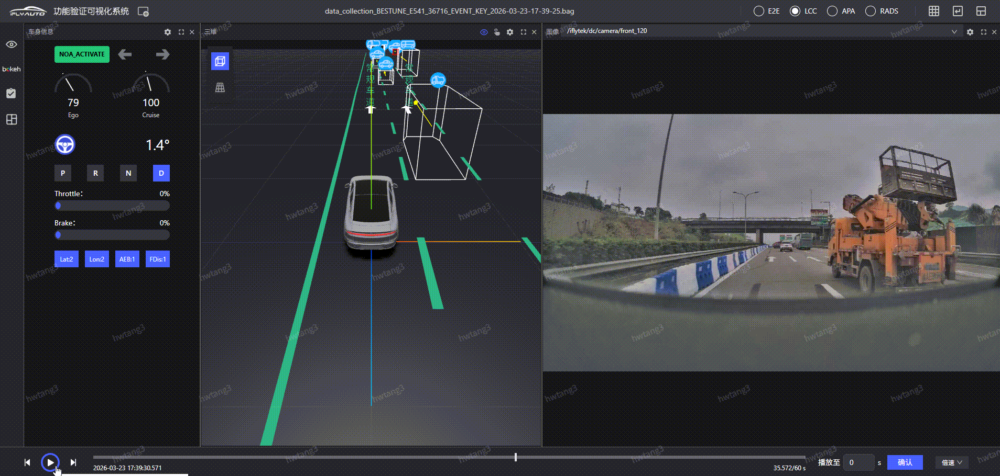

+ 典型场景：雪地行驶，不变道

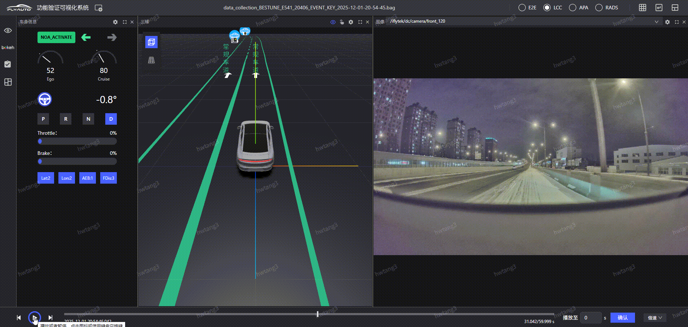

#### 1.1.2 缺乏交互建模，行为保守
+ 规则系统将他车视为"按预测轨迹运动的障碍物"，不建模自车行为对他车的影响
+ 无法实现博弈式交互（如通过加速表达抢行意图，促使对方减速让行）
+ 结果：系统倾向于保守等待，效率低下，不拟人，以及无法识别意图碰撞风险
+ 典型场景：他车连续掉头，持续让行

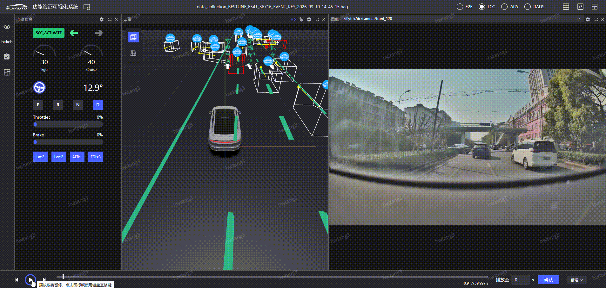

+ 典型场景：自车与他车同时变道，不加速抢行

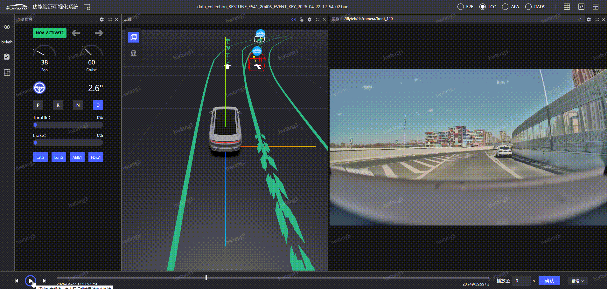

+ 典型场景：进入对向车道不起步

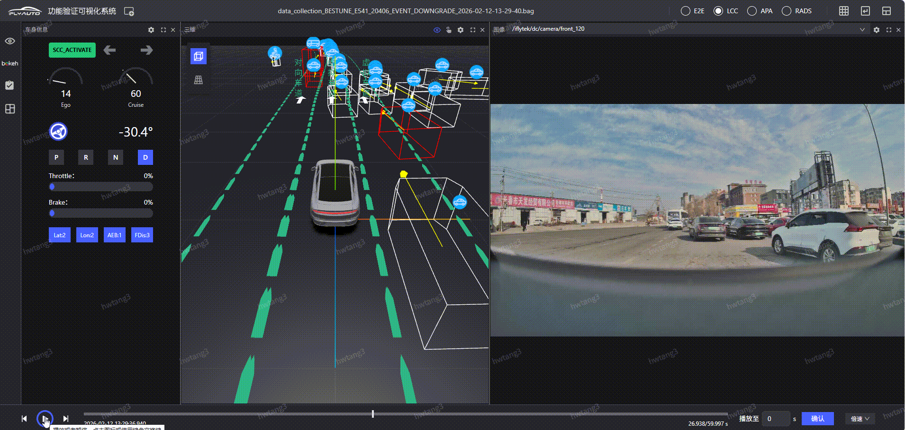

+ 典型场景：他车遮挡变道减速不足

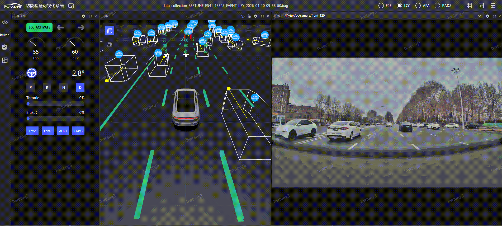

+ 典型场景：鬼探头减速不足

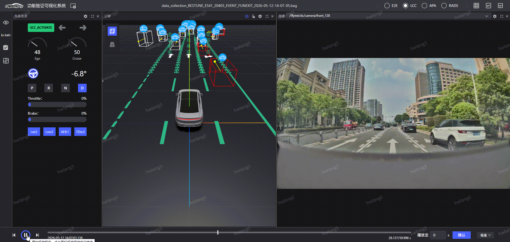

### 1.2 路径-速度解耦规划局限性
**路径-速度解耦架构**（Path-Speed Decoupling），虽然工程成熟度高、计算效率可控，但存在以下核心瓶颈：

#### 1.2.1 解耦次优性
横向路径（SL优化）和纵向速度（ST/VT优化）分别优化后拼接，无法找到时空全局最优解。

**典型场景**：窄道会车

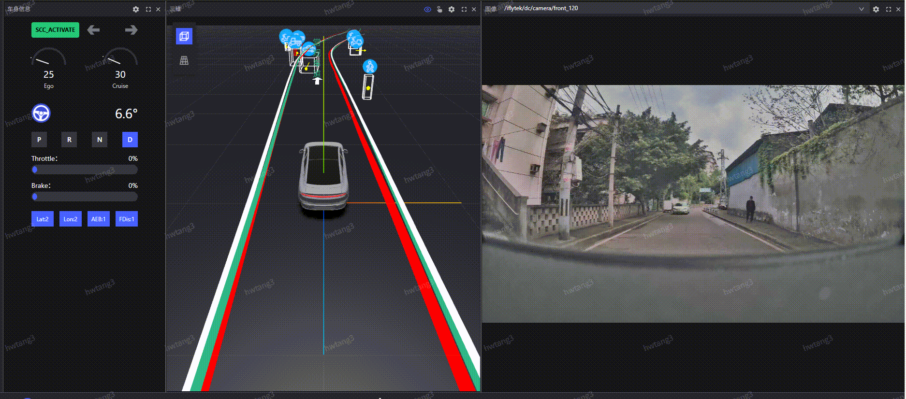

+ **问题表现**：对向车侵入自车道，自车横向避让不足，急刹接管
+ **根本原因**：横向规划时未考虑纵向减速配合，解空间受限
+ **理想行为**：边横向避让边纵向减速，平滑通过

#### 1.2.2 交互能力不足
基于规则的障碍物决策难以处理多车博弈场景。

**典型场景**：汇流并道

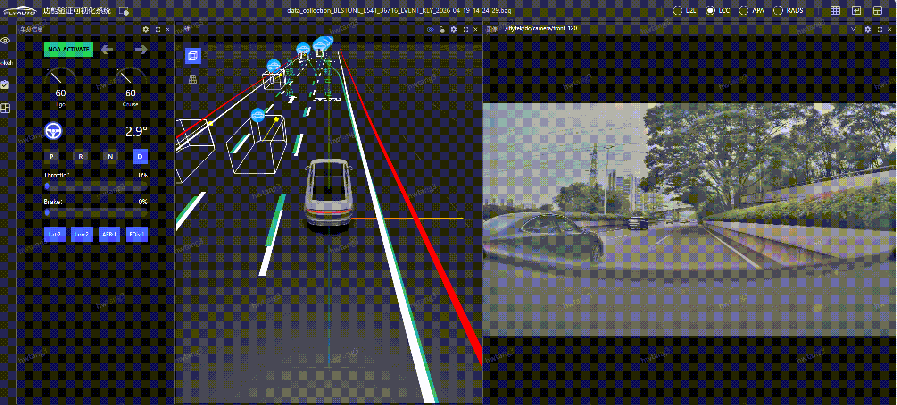

+ **问题表现**：自车向左汇流时，自车对前方车辆进行较大减速避让，汇入主路时距离后车过近造成恐慌感
+ **根本原因**：解耦决策无法根据他车意图（抢行/让行）动态调整，只能保守让行
+ **理想行为**：同时考虑多车行为，加速汇入主路

**典型场景**：路口他车近距离抢道

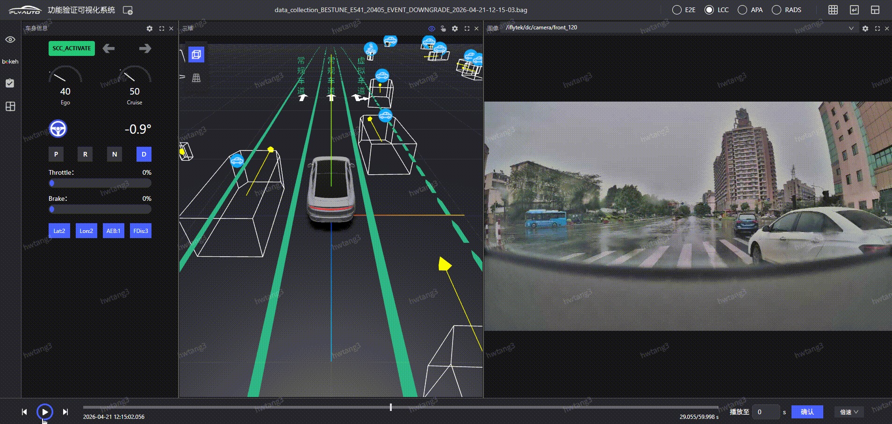

+ **问题表现**：侧方车近距离抢道，持续靠左，自车横向未进行避让，纵向急刹=
+ **根本原因**：预测一旦偏差，横纵独立规划都"看不到"威胁，单维度无法独立解决
+ **理想行为**：提前减速+横向偏移让行

---

## 2. 技术方案实现
### 2.1 整体架构
**数据流：**

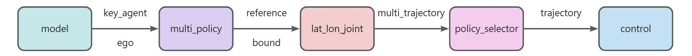

**整体架构：**

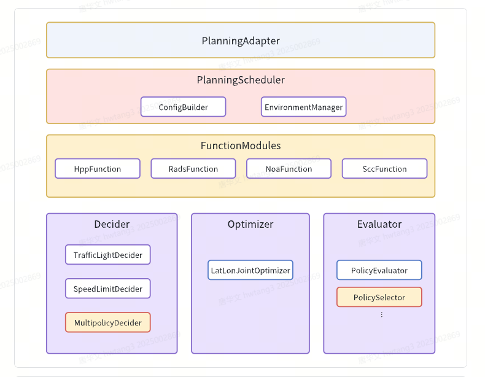

#### 2.1.1 障碍物决策导向两阶段模型
**模型架构：**

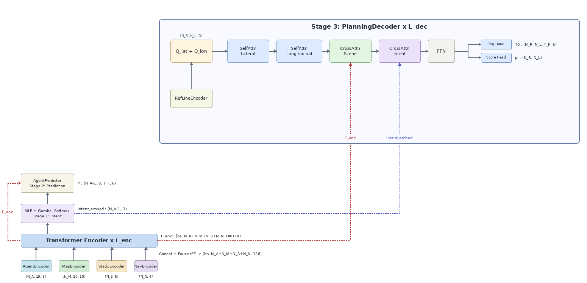

> 模型采用 Encoder-Decoder 架构：Encoder 将场景元素（Agent 历史轨迹、地图、静态障碍物、红绿灯、导航信息）统一编码并通过 Transformer 全局交互；Decoder 分三阶段输出——Stage 1 预测每个障碍物的决策意图（9类），Stage 2 在各决策条件下生成障碍物多模态预测轨迹（9条/障碍物），Stage 3 通过交叉注意力解码自车多模态规划轨迹（N_R × N_L 条）。模型输出的决策、预测轨迹和规划轨迹作为下游多决策时空联合优化的输入。
>

##### ① 问题形式
输入输出定义：

**(T₀, π₀), P₁:Nₐ, I₁:Nₐ = f(A, O, M, C, N | φ)**

各符号含义：

| 符号 | 含义 |
| --- | --- |
| A = {A₀, ..., Aₙₐ} | 动态障碍物集合，A₀为自车 |
| O = {O₁, ..., Oₙₛ} | 静态障碍物集合 |
| M | 地图 |
| C | 交通信号上下文（红绿灯历史状态序列） |
| N | 导航信息（路线点、车道属性、导航动作） |
| T₀ | 自车输出的 N_R × N_L 条规划轨迹 |
| π₀ | 每条轨迹的置信度分数 |
| P₁:Nₐ | 障碍物多模态预测轨迹（每个障碍物 9 条决策条件化轨迹） |
| I₁:Nₐ | 障碍物决策意图（每个障碍物 9 类纵×横联合决策概率） |


##### ② 数据处理
基于plan_debug_msg的定位时间localization_timestamp，找到与其最近的loc_msg，提取自车、障碍物、地图及导航信息，通过数据清洗得到最终数据

**定位信息处理：**

由于感知消息（10Hz）和定位消息的时间戳不完全对齐，且导航消息（1-2Hz）存在延迟，需要对自车状态做时间插值：

| 处理步骤 | 功能说明 |
| :---: | --- |
| 定位缓存 | 每次定位更新时缓存当前时刻的 pose(4x4)、vel(m/s)、acc(m/s²) 到历史队列 |
| 时间戳对齐 | 感知消息到达时，根据其时间戳在定位历史队列中做线性插值，得到该时刻精确的自车状态 |
| 坐标补偿 | 导航消息延迟 0.5-3s，通过 `transform = inv(当前pose) @ 导航时刻pose` 将导航坐标转到当前自车系 |
| 历史帧补偿 | 时序输入（红绿灯/车道线）的历史帧坐标需要转到当前帧：`pts_now = inv(pose_now) @ pose_hist @ pts_hist` |


> 插值保证了所有输入数据在时间上对齐到同一时刻，坐标补偿保证了所有空间数据在坐标系上对齐到当前自车系。
>

**自车状态处理（process_ego_state_info）：**

```plain
定位模块输出: pose(4x4), vel(m/s), acc(m/s²), wheel_angle(rad), yaw_rate(rad/s)
交互输入: turn_signal ∈ {0=关, 1=左拨杆, 2=右拨杆}
  → 提取当前帧自车 7 维运动状态:
      x, y      ← pose[:2, 3]                 (位置)
      θ         ← pose 旋转矩阵反解            (航向)
      v         ← vel                          (速度标量)
      a         ← acc                          (纵向加速度)
      δ         ← wheel_angle                  (前轮转角)
      ω         ← yaw_rate                     (偏航角速度)
  → 输出: ego_state (7,) = [x, y, θ, v, a, δ, ω]
          turn_signal (1,)
          —— 二者作为模型的自车输入
```

> 模型不输入自车历史轨迹，仅输入当前帧 7 维运动状态与拨杆信号；拨杆信号显式表达驾驶员的变道意图，让模型在变道触发时能直接响应而无需依靠场景推断。
>

**障碍物处理（process_obstacle_info）：**

+ **时间间隔均匀化**：原始数据时间间隔不均匀或者两帧数据相同，采用 PchipInterpolator 对障碍物位置(x,y)重采样，使时间间隔为 0.1s
+ **静止障碍物轨迹异常**：感知误差导致静止物体有微小位移。处理方法：判断障碍物属性，将静止物体轨迹优化为 0

```plain
感知输出: objs_location(N,3), objs_dims(N,3), objs_rotation_z(N,), objs_velocity_abs(N,2), objs_label(N,), objs_score(N,)
  → 感知范围裁剪（超出 percep_range 的障碍物丢弃）
  → 尺寸轴交换: [w,l,h] → [l,w,h]
  → 角点计算: location + size + rotation → 8个3D角点 (N, 8, 3)
  → 数据增强: 尺寸/角点/速度加随机噪声
  → 按置信度降序排列，截断到 max_instance (N_A)，不够的 padding 零
  → 输出: objs_corner_pts (N_A, 8, 3), objs_vel (N_A, 2),
          objs_label (N_A,), objs_score (N_A,), objs_mask (N_A,)
```

> 障碍物为单帧输入，与 AgentEncoder 对齐。AgentEncoder 内部通过历史轨迹（T_H=20帧）的帧间差分获取运动特征。
>

**障碍物决策标签生成（Intent Label）：**

模型 Stage 1 需要监督信号：自车对每个障碍物的决策标签（9类 = 纵向3类 × 横向3类）。该标签基于**真实未来轨迹**离线生成。

| 纵向决策 | 判定条件 | 物理含义 |
| :---: | --- | --- |
| LonIgnore (0) | 自车与障碍物无纵向交互 | 不超不让，各走各的 |
| Overtake (1) | 自车最终在障碍物前方 | 自车超过障碍物 |
| Yield (2) | 自车最终在障碍物后方 | 自车让障碍物先走 |


| 横向决策 | 判定条件 | 物理含义 |
| :---: | --- | --- |
| LatIgnore (0) | 自车与障碍物无横向偏移 | 不绕行 |
| NudgeLeft (1) | 自车从障碍物左侧绕过 | 向左避让 |
| NudgeRight (2) | 自车从障碍物右侧绕过 | 向右避让 |


联合标签：`gt_label = lon_action * 3 + lat_action`，取值 0~8。

**纵向决策标注算法：**

```python
def label_longitudinal(ego_traj, obs_traj, obs_heading):
    """
    ego_traj: (T, 2) 自车未来T帧位置
    obs_traj: (T, 2) 障碍物未来T帧位置
    obs_heading: (T,) 障碍物航向角
    返回: 0=LonIgnore, 1=Overtake, 2=Yield
    """
    # 取未来轨迹终点
    ego_end = ego_traj[-1]
    obs_end = obs_traj[-1]
    obs_theta = obs_heading[-1]

    # 自车终点相对障碍物终点的位移
    delta = ego_end - obs_end

    # 投影到障碍物航向方向 = 纵向距离
    longitudinal = delta[0] * np.cos(obs_theta) + delta[1] * np.sin(obs_theta)
    # 投影到障碍物航向垂直方向 = 横向距离
    lateral = -delta[0] * np.sin(obs_theta) + delta[1] * np.cos(obs_theta)

    # 横向距离过大 -> 无纵向交互
    if abs(lateral) > LANE_WIDTH * 1.5:  # 5.6m
        return 0  # LonIgnore

    # 纵向距离过大 -> 无纵向交互
    if abs(longitudinal) > LON_THRESHOLD:  # 50m
        return 0  # LonIgnore

    # 判断超车/让行
    if longitudinal > OVERTAKE_MARGIN:  # 2m
        return 1  # Overtake
    elif longitudinal < -YIELD_MARGIN:  # -2m
        return 2  # Yield
    else:
        return 0  # LonIgnore
```

**横向决策标注算法：**

```python
def label_lateral(ego_traj, obs_traj, obs_heading):
    """
    判断自车是否从障碍物左侧或右侧绕过
    返回: 0=LatIgnore, 1=NudgeLeft, 2=NudgeRight
    """
    # 计算每帧自车相对障碍物的横向偏移
    lateral_offsets = []
    for t in range(len(ego_traj)):
        delta = ego_traj[t] - obs_traj[min(t, len(obs_traj)-1)]
        theta = obs_heading[min(t, len(obs_heading)-1)]
        # 正值=自车在障碍物左侧，负值=右侧
        lat = -delta[0] * np.sin(theta) + delta[1] * np.cos(theta)
        lateral_offsets.append(lat)

    # 取轨迹中段的平均横向偏移（避免首尾噪声）
    mid_start = len(lateral_offsets) // 4
    mid_end = len(lateral_offsets) * 3 // 4
    avg_lateral = np.mean(lateral_offsets[mid_start:mid_end])

    # 判断障碍物是否在自车路径上（需要绕行的前提）
    min_abs_lateral = min(abs(l) for l in lateral_offsets)
    if min_abs_lateral > (OBS_WIDTH + EGO_WIDTH) / 2 + SAFE_MARGIN:
        return 0  # LatIgnore，障碍物不在路径上

    # 判断绕行方向
    if avg_lateral > NUDGE_THRESHOLD:   # 1.0m
        return 1  # NudgeLeft
    elif avg_lateral < -NUDGE_THRESHOLD:
        return 2  # NudgeRight
    else:
        return 0  # LatIgnore
```

**标注流程汇总：**

```python
def generate_intent_labels(ego_future, obs_futures, obs_headings):
    """
    ego_future: (T, 2) 自车GT未来轨迹
    obs_futures: (N_A-1, T, 2) 所有障碍物GT未来轨迹
    obs_headings: (N_A-1, T) 所有障碍物GT未来航向
    返回: (N_A-1,) 每个障碍物的决策标签 (0~8)
    """
    labels = []
    for k in range(len(obs_futures)):
        lon = label_longitudinal(ego_future, obs_futures[k], obs_headings[k])
        lat = label_lateral(ego_future, obs_futures[k], obs_headings[k])
        label = lon * 3 + lat
        labels.append(label)
    return np.array(labels)
```

**关键参数：**

| 参数 | 典型值 | 说明 |
| :---: | :---: | --- |
| LANE_WIDTH | 3.75m | 车道宽度 |
| LON_THRESHOLD | 50m | 纵向交互判定距离 |
| OVERTAKE_MARGIN | 2m | 超车判定余量 |
| YIELD_MARGIN | 2m | 让行判定余量 |
| NUDGE_THRESHOLD | 1.0m | 横向绕行判定阈值 |
| SAFE_MARGIN | 0.5m | 安全余量 |
| OBS_WIDTH | 2.0m | 障碍物典型宽度 |
| EGO_WIDTH | 1.9m | 自车宽度 |


**标签分布（典型）：**

| 标签 | 含义 | 占比 |
| :---: | --- | :---: |
| 0 (Ignore+Ignore) | 无交互 | ~65% |
| 3 (Overtake+Ignore) | 超车不绕 | ~12% |
| 6 (Yield+Ignore) | 让行不绕 | ~15% |
| 4 (Overtake+Left) | 超车+左绕 | ~3% |
| 5 (Overtake+Right) | 超车+右绕 | ~2% |
| 7 (Yield+Left) | 让行+左绕 | ~1% |
| 其他 | 少见组合 | ~2% |


> 注：Ignore 占比高是正常的——大部分障碍物与自车无直接交互（对向车道、远处车辆）。训练时可对少数类做 focal loss 或过采样。
>

**标签粒度与时间范围：**

+ 每个训练样本（当前帧 t 的场景快照），对每个障碍物生成 **1 个标签**（不是逐帧标注）
+ 该标签描述"从当前帧到未来 5 秒（50帧@10Hz），自车对该障碍物的**整体决策结果**"
+ 纵向决策：看 GT 轨迹**终点**的纵向相对位置（5秒后谁在前谁在后）
+ 横向决策：看 GT 轨迹**中段**（第12<sub>37帧，约1.2s</sub>3.7s）的平均横向偏移

**未来轨迹不足5秒的处理：**

部分障碍物可能中途消失（驶出感知范围、被遮挡、感知丢失），GT 轨迹不满 50 帧：

```python
def get_effective_endpoint(obs_traj, obs_heading, valid_mask):
    """
    获取有效终点，处理轨迹不足5秒的情况
    obs_traj: (T, 2)
    valid_mask: (T,) bool
    """
    num_valid = valid_mask.sum()

    # 有效帧太少（<10帧，不到1秒）-> 无法可靠判断
    if num_valid < MIN_VALID_FRAMES:  # MIN_VALID_FRAMES = 10
        return None  # 标签设为 LonIgnore + LatIgnore = 0

    # 取最后一个有效帧作为终点
    last_valid_idx = np.where(valid_mask)[0][-1]
    endpoint = obs_traj[last_valid_idx]
    heading = obs_heading[last_valid_idx]

    return endpoint, heading, last_valid_idx
```

处理规则：

| 情况 | 有效帧数 | 处理方式 |
| :---: | :---: | --- |
| 正常 | 50帧（完整5秒） | 用第50帧终点判断纵向，用第12~37帧判断横向 |
| 部分缺失 | 10~49帧 | 用最后有效帧作为终点判断纵向，横向取有效范围的中段 |
| 严重缺失 | <10帧（不到1秒） | 直接标为 LonIgnore + LatIgnore（标签=0），不参与 L_intent 计算 |
| 当前帧不可见 | 0帧 | 不预测该障碍物（不进入模型） |


> 对于"部分缺失"的情况，纵向判断的可靠性会降低（只看了2~4秒的结果），但仍然比不标注好。横向判断受影响较小，因为绕行动作通常在前几秒就能体现。
>

**车道线处理（process_lane_info）— 时序输入：**

```plain
感知输出: pts(N,20,2), pts_xushi(N,19), pts_yanse(N,19), labels(N,), scores(N,)
  → 感知范围裁剪
  → 按置信度降序排列，截断到 max_instance (N_L)，不够的 padding 零
  → 缓存到历史队列
  → 时序打包（pack_temporal_info, hist_ts 帧历史）:
      对每个历史帧:
        ① 坐标补偿: rela_pose 变换 20 个采样点到当前帧
        ② 随机丢弃: 以 line_drop_prob 概率 mask 掉部分车道线
        ③ 计算时间差: lanes_time = now_time - frame_time
  → 输出: lanes_pts (T_M, N_L, 20, 2),
          lanes_time (T_M,), lanes_mask (T_M, N_L)
```

> 车道线为时序输入，与 LaneEncoder（时序编码）对齐。多帧叠加 + time_embedding 使模型对感知闪烁更鲁棒。
>

**时序打包机制（pack_temporal_info）：**

车道线和红绿灯的时序输入共用同一套队列管理逻辑：

```plain
输入: 当前帧数据, 历史队列, 需要的历史帧数 hist_ts
流程:
  1. 当前帧 append 到队列，超过 hist_ts+1 就 pop 最老的
  2. 从队列尾部（最新）往前取 hist_ts+1 帧
  3. 每帧调用 compensate_func:
     - 坐标变换到当前帧（inv(now_pose) @ frame_pose）
     - 随机丢弃（数据增强）
     - 计算时间差
  4. 不够的帧用 create_empty_frame_func 填充（全零 + mask=True）
  5. 所有帧 np.stack 成固定 shape 数组
输出: dict of numpy arrays, 第一维是时间维度
```

> 关键设计：即使当前帧是 extract_only（不推理），时序相关函数仍然执行缓存操作。这保证了当有效帧到来时，历史队列已经填满，不会出现冷启动问题。
>

**红绿灯处理（process_tsr_info）：**

```plain
感知输出: attr(3,) [左转灯状态, 直行灯状态, 右转灯状态], light_lsr(图像检测框)
  → 距离估算: 通过前视相机中灯的像素大小反推物理距离，上限200m
  → 距离过滤: >150m 时灯状态清零（太远不可靠）
  → 缓存到历史队列（T_C 帧）
  → 倒序填充固定数组:
      从最新帧往回填，不够的保持零 + mask=True
  → 距离归一化: dist / 75（映射到 0~2 范围）
  → 输出: attr (T_C, 3), dist (T_C, 1), mask (T_C, 1)
```

> 红绿灯为时序输入，与 ContextEncoder 对齐。多帧历史状态使模型能感知信号灯变化趋势（如即将变绿）。
>

**导航数据提取与处理：**

除自车/障碍物/车道线数据外，还需提取高德导航信息（amap_navi），为模型提供全局路线引导。导航数据的处理流程：

```python
lane_info = {
    "dist": 150.0,                    # 距路口距离
    "back_lanes": [                   # 路口前车道
        {"lane_action": 1},           # 车道1: 左转
        {"lane_action": 0},           # 车道2: 直行
        {"lane_action": 3}            # 车道3: 右转
    ],
    "front_lanes": [                  # 路口后车道
        {"lane_action": 1},           # 对应车道1
        {"lane_action": 0},           # 对应车道2
        {"lane_action": 3}            # 对应车道3
    ],
    "extend_lanes": []                # 无扩展车道
}
```

| 处理步骤 | 功能说明 |
| :---: | --- |
| 导航消息定位 | 根据当前帧时间戳，通过二分查找找到最近的导航消息帧（容忍延迟：低速<6s，高速<3s） |
| 坐标变换 | 将导航路线点从经纬度(LLA)转换到当前自车坐标系(ego frame)：LLA→ENU→旋转对齐→时间补偿 |
| 里程坐标构建 | 遍历所有link累加长度构建s坐标系，定位自车在路线上的里程位置 |
| 路线切分 | 在自车投影点处将路线切分为历史段和未来段，取未来段作为导航路径 |
| 车道信息提取 | 提取前方路口的车道转向箭头（back_lanes/front_lanes/extend_lanes）及路口距离 |
| 引导信息提取 | 提取导航转向指令（maneuver_id：左转/右转/直行/掉头等）及执行距离 |


时序输入（车道线、红绿灯）的优势：

+ 感知闪烁鲁棒：车道线单帧漏检不影响，历史帧提供补充
+ 信号灯趋势感知：多帧红绿灯状态序列使模型能预判信号变化
+ 遮挡恢复：被遮挡的车道线在历史帧中可能可见

**数据增强（Data Augmentation）：**

训练时对输入数据施加多种随机扰动，提升模型对感知噪声和定位误差的鲁棒性：

| 增强类型 | 作用对象 | 具体方式 | 参数 |
| :---: | :---: | --- | --- |
| 自车航向角噪声 | 全局坐标系 | 每个 episode 开始时，以概率 `noise_prob` 对自车 pose 右乘一个 yaw 旋转矩阵，所有后续帧的定位都带上这个偏移 | yaw_noise_range（度），noise_prob |
| 感知范围随机裁剪 | 障碍物/车道线 | 每帧随机缩放感知范围的上下左右边界，模拟感知距离波动 | noise_percep_range: ((min_x_range, max_x_range), (min_y_range, max_y_range)) |
| 障碍物尺寸噪声 | 障碍物 bbox | 长度 ±0.1m，宽度/高度 ±0.05m 均匀随机噪声 | 固定范围 |
| 障碍物位置噪声 | 障碍物角点 | 每个角点坐标 ±0.05m 均匀随机噪声 | 固定范围 |
| 障碍物速度噪声 | 障碍物速度 | 纵向 ±0.1m/s，横向 ±0.05m/s 均匀随机噪声 | 固定范围 |
| 障碍物随机丢弃 | 障碍物 mask | 以概率 `obj_drop_prob` 随机将部分障碍物标记为无效（模拟感知漏检） | obj_drop_prob |
| 车道线随机丢弃 | 车道线 mask | 以概率 `line_drop_prob` 随机将部分车道线标记为无效（模拟感知漏检） | line_drop_prob |
| 导航距离噪声 | 路口/引导距离 | 对 crosses_lane_dist 和 guides_act_dist 加 ±enhance_scale 均匀随机偏移 | lane_dist_enhance, guide_dist_enhance |


##### ③ 编码器（Encoder）
编码器将场景中所有元素统一编码为 D=128 维特征向量，再通过 Transformer 全局交互。

**自车状态编码**

| 全局坐标系特征 | 大小（T表示时间步数） |
| :---: | --- |
| position | np.zeros((T, 2), dtype=np.float64) |
| heading | np.zeros((T), dtype=np.float64) |
| velocity | np.zeros((T, 2), dtype=np.float64) |
| acceleration | np.zeros((T, 2), dtype=np.float64) |
| shape | np.zeros((T, 2), dtype=np.float64) |
| turn_signal | np.zeros((1,), dtype=np.int64) |
| valid_mask | np.ones(T, dtype=np.bool) |


```python
ego_state = [x, y, θ, v, a, δ, ω]                      # 7维连续运动状态
turn_signal_emb = turn_signal_embedding(turn_signal)   # nn.Embedding(3, D)，{0关 / 1左 / 2右}
E_AV = StateDropoutAttentionEncoder(ego_state) + turn_signal_emb  # → (bs, 1, D=128)
```

> 拨杆信号通过 `nn.Embedding(num_classes=3, dim=D)` 查表得到 D 维嵌入，与运动状态编码相加后融入 E_AV，使得变道触发时刻自车 token 直接携带"我要往左/往右"的语义。

> 注：E_AV 已包含在 E_A 的第0个位置（A₀=自车），不单独拼接。
>

**Agent 编码（AgentEncoder）**

| 全局坐标系特征 | 大小（N表示障碍物数量，T表示时间步数） |
| :---: | :---: |
| position | np.zeros((N, T, 2), dtype=np.float64) |
| heading | np.zeros((N, T), dtype=np.float64) |
| velocity | np.zeros((N, T, 2), dtype=np.float64) |
| shape | np.zeros((N, T, 2), dtype=np.float64) |
| valid_mask | np.zeros((N, T), dtype=np.bool) |


非自回归 (Non-Autoregressive)：一次输入一组数据，一次输出一组预测数据

+ 并行化，自回归AT必须串行运行，即运算一次输出一个数据。而NAT可以并行运算，输入一个完整序列，输出一整个预测序列。

采用NeighborhoodAttention1D机制，Neighborhood Attention 是一种改进的 局部注意力机制，与标准 全局自注意力 (Self-Attention) 的不同之处在于：

+ 计算复杂度降低：标准 Transformer 自注意力的复杂度是 O(N²)，而 NA 仅关注局部窗口，降低到 O(N)。
+ 更适用于长序列数据：减少内存占用，提高训练和推理效率。
+ 类似 CNN 的局部感受野：只在邻近的 token 之间计算注意力，提高泛化能力。

每个 agent（不含自车）的历史轨迹 T_H=20 帧，计算帧间差分得到运动特征：

```python
agent_feature = torch.cat([
    to_vector(position, valid_mask),          # Δp: 位置差分 — 2维
    to_vector(velocity, valid_mask),          # Δv: 速度差分 — 2维
    heading_vec.cos(), heading_vec.sin(),     # cos(Δθ), sin(Δθ) — 2维
    shape[:, :, 1:],                          # 尺寸 (width, length) — 2维
    valid_mask_vec.float().unsqueeze(-1),     # 有效标志 — 1维
], dim=-1)  # → (bs, N_A, T_H-1=19, 9)
```

编码流程：

```plain
(bs, N_A, 19, 9)
  → reshape: (bs*N_A, 19, 9)
  → NAT-FPN: embed→(32,19) → down→(64,10) → down→(128,5) → 取最后步
  → (bs*N_A, 128) → reshape: (bs, N_A, 128)
  → + type_embedding(category)
  → 输出 E_A: (bs, N_A, D=128)
```

**地图编码（MapEncoder）— 时序编码**

| 地图特征 | 大小（N_M 为车道多边形数量，n_p = 20 为采样点数） |
| :---: | :---: |
| F_P (polygon_feature) | (N_M, n_p, 10) |
| lane_type | (N_M,) |
| speed_limit | (N_M,) |
| valid_mask | (N_M, n_p) |


几何特征（point_*、valid_mask）刻画车道**形状**；属性特征刻画车道**语义**：

+ `lane_type`：车道类型 ID（普通车道 / 匝道 / 应急车道 / HOV 等），离散值，查表 Embedding
+ `speed_limit`：该车道限速（km/h），连续值，傅里叶编码


每条车道多边形取 20 个采样点，构造 10 维特征：

```python
polygon_feature = torch.cat([
    point_position[:,:,0] - polygon_center[...,None,:2],  # 相对中心位置 — 2维
    point_vector[:,:,0],                                    # 方向向量 — 2维
    point_orientation[:,:,0].cos(),                         # cos(θ) — 1维
    point_orientation[:,:,0].sin(),                         # sin(θ) — 1维
    point_position[:,:,1] - point_position[:,:,0],         # 左边界偏移 — 2维
    point_position[:,:,2] - point_position[:,:,0],         # 右边界偏移 — 2维
], dim=-1)  # → (bs, N_M, 20, 10)
```

**时间嵌入（time_emb）实现：**

`lanes_time` 是每帧相对当前帧的时间差（单位：秒），例如 `[-0.3, -0.2, -0.1, 0.0]` 表示 4 帧历史。

```python
# 1. 正弦位置编码：将标量时间差映射到 D 维向量
#    pos2posemb1d: 用不同频率的 sin/cos 生成位置编码
#    输入: lanes_time (bs, T_M, 1)
#    输出: (bs, T_M, D)
time_pos = pos2posemb1d(lanes_time[..., None], num_pos_feats=D)

# 2. 线性投影 + LayerNorm：将正弦编码映射到特征空间
#    time_embedding = nn.Sequential(Linear(D, D), LayerNorm(D))
time_emb = time_embedding(time_pos)  # (bs, T_M, D)

# 3. 广播加到每条车道线上：同一帧内所有车道线共享同一个时间嵌入
lanes_feat = lanes_feat + time_emb[:, :, None, :]
# time_emb[:, :, None, :] shape: (bs, T_M, 1, D) → 广播到 (bs, T_M, N_M, D)
```

> 正弦位置编码的原理：用不同频率的 sin/cos 函数将连续时间值映射到高维空间，使模型能区分不同时刻。频率从低到高覆盖，低频捕捉粗粒度时间关系，高频捕捉细粒度时间差异。经过 Linear+LayerNorm 后投影到与其他特征相同的语义空间。
>

编码流程（时序）：

```plain
(bs, T_M, N_M, 20, 10)
  → reshape: (bs*T_M*N_M, 20, 10)
  → PointsEncoder 两层 max-pool: → (bs*T_M*N_M, 128)
  → reshape: (bs, T_M, N_M, 128)
  → + type_emb + speed_limit_emb（lane_type 查表 Embedding；speed_limit 傅里叶连续编码）
  → + time_emb（正弦位置编码 → Linear → LayerNorm → 广播到每条车道线）
  → reshape: (bs, T_M*N_M, 128)
  → 输出 E_M: (bs, T_M*N_M, D=128)
```

> 地图编码在原有单帧特征（点坐标、方向、边界偏移）基础上增加了时序维度：多帧地图感知结果叠加输入，通过时间嵌入区分不同时刻，使模型能感知地图元素的时序一致性。
>

**红绿灯编码（ContextEncoder）**

| 红绿灯特征 | 大小（T_C = 20，历史交通灯帧数；N_C = 5，每帧 5 路特征：左灯/直灯/右灯/距离/时序） |
| :---: | :---: |
| tsr_feat | T_C × N_C  （= 20 × 5） |


其中 3 路方向灯状态（attr 的左/直/右）+ 距离（dist）+ 时序位置共 5 路在编码阶段拼接为输入特征；`mask` 标记哪些历史帧有效（不计入 N_C）。

```python
# 输入: attr (bs, T_C, 3), dist (bs, T_C), mask (bs, T_C)

left_embed = attr_embedding(attr[..., 0]) + left_embedding    # 左转灯状态嵌入
straight_embed = attr_embedding(attr[..., 1]) + straight_embedding  # 直行灯状态嵌入
right_embed = attr_embedding(attr[..., 2]) + right_embedding  # 右转灯状态嵌入
dist_embed = dist_MLP(dist[..., None])                         # 距离嵌入
time_embed = time_embedding                                    # 时序位置嵌入

# 5 路特征作为独立 token：(T_C, N_C=5) 个 token，各自 D 维
tsr_feat = MLP(stack([left_embed, straight_embed, right_embed, time_embed, dist_embed], dim=-2))
# → (bs, T_C, N_C=5, D=128) → reshape → (bs, T_C*N_C, D=128)
```

编码流程：

```plain
attr (bs, T_C, 3) + dist (bs, T_C)
  → 3个方向灯状态Embedding + 距离MLP + 时序Embedding
  → 5 路特征独立 token（不再拼接为一路）→ MLP
  → (bs, T_C, N_C, D=128)
  → reshape: (bs, T_C*N_C, D=128)
  → 输出 E_C: (bs, T_C*N_C, D=128)
```

> Context 编码器将红绿灯的历史状态序列编码为特征向量，使模型能感知信号灯变化趋势（如即将变绿），结合距离信息判断是否需要减速停车。
>

**静态障碍物编码（StaticObjectsEncoder）**

```python
x = FourierEmbedding(shape)           # (N_S, 2) → (N_S, 128)
x = x + category_embedding(category)  # + 类型嵌入
# 输出 E_O: (bs, N_S, D=128)
```

**导航信息编码（NavigationEncoder）**

| 导航特征 | 大小 |
| :---: | :---: |
| fut_nav_pts | np.zeros((n_fut_step, 4), dtype=np.float32) |
| fut_nav_pts_road_class | np.zeros((n_fut_step,), dtype=np.int64) |
| fut_nav_pts_mask | np.zeros((n_fut_step,), dtype=np.float32) |
| crosses_lanes_back_act | np.full((max_n_cross, max_n_lane), 255, dtype=np.int64) |
| crosses_lanes_front_act | np.full((max_n_cross, max_n_lane), 255, dtype=np.int64) |
| crosses_lanes_extend_act | np.full((max_n_cross, max_n_lane), 255, dtype=np.int64) |
| crosses_lanes_mask | np.zeros((max_n_cross, max_n_lane), dtype=np.float32) |
| crosses_lane_dist | np.zeros((max_n_cross,), dtype=np.float32) |
| crosses_num_lane | np.zeros((max_n_cross,), dtype=np.int64) |
| guides_act | np.full((max_n_guide,), 255, dtype=np.int64) |
| guides_act_mask | np.zeros((max_n_guide,), dtype=np.float32) |
| guides_act_dist | np.zeros((max_n_guide,), dtype=np.float32) |


导航信息包含三类语义不同的子信息，分别编码后融合：

```python
# 1. 路线点编码：fut_nav_pts (bs, n_fut_step, 4) → 空间路径特征
nav_route_feature = NAT_FPN(fut_nav_pts * fut_nav_pts_mask)  # → (bs, D=128)

# 2. 车道信息编码：crosses_lanes (bs, max_n_cross, max_n_lane) → 路口拓扑特征
lane_feature = torch.cat([
    crosses_lanes_back_act_embed,    # 车道动作嵌入 — D维
    crosses_lanes_extend_act_embed,  # 延伸方向嵌入 — D维
    crosses_lane_dist_embed,         # 距离傅里叶嵌入 — D维
], dim=-1)  # → (bs, max_n_cross, 3D)
lane_feature = LaneMLPEncoder(lane_feature, crosses_lanes_mask)  # → (bs, max_n_cross, D)

# 3. 引导动作编码：guides_act (bs, max_n_guide) → 决策级语义特征
guide_feature = torch.cat([
    guides_act_embed,       # 动作类型嵌入 — D维
    guides_dist_embed,      # 距离傅里叶嵌入 — D维
], dim=-1)  # → (bs, max_n_guide, 2D)
guide_feature = GuideMLPEncoder(guide_feature, guides_act_mask)  # → (bs, max_n_guide, D)
```

编码流程：

```plain
fut_nav_pts (bs, n_fut_step, 4)
  → mask处理 + NAT-FPN时序编码
  → (bs, 1, D=128)  [路线全局特征]

crosses_lanes (bs, max_n_cross, max_n_lane)
  → 动作Embedding + 距离FourierEmb + MLP
  → (bs, max_n_cross, D=128)  [每个路口一个token]

guides_act (bs, max_n_guide)
  → 动作Embedding + 距离FourierEmb + MLP
  → (bs, max_n_guide, D=128)  [每个引导一个token]

合并: E_N = concat([route_token, lane_tokens, guide_tokens])
     → (bs, N_N, D=128)  其中 N_N = 1 + max_n_cross + max_n_guide
```

> 导航编码器输出 E_N 参与 Transformer Encoder 的全局自注意力，使场景中所有元素都能感知导航意图。路线点提供几何引导（往哪弯），车道信息提供拓扑约束（哪条道能转），引导动作提供决策语义（应该做什么）。三者互补，缺一不可。
>

**Transformer Encoder（全局交互）**

```python
# 拼接所有编码器输出
x = concat([E_A, E_O, E_M, E_C, E_N], dim=1)  # (bs, N_A + N_S + T_M*N_M + T_C*N_C + N_N, 128)
x = x + FourierEmbedding(pos)            # 加入位置编码 PE

# 4层全局自注意力
for blk in encoder_blocks:                # × L_enc=4
    x = blk(x, key_padding_mask)          # MHA + FFN + residual + LN
x = LayerNorm(x)

# 输出 E_enc: (bs, N_A + N_S + T_M*N_M + T_C*N_C + N_N, D=128)
```

经过4层全局自注意力后，每个 token 已融合场景中所有其他元素的信息（包括导航路线、车道拓扑和引导动作）。

##### ④ 解码器（Decoder）
E_enc 的结构：

+ E_enc[:, 0] = 自车特征
+ E_enc[:, 1:N_A] = 障碍物特征（N_A-1 个）
+ E_enc[:, N_A : N_A + N_S] = 静态障碍物特征
+ E_enc[:, N_A + N_S : N_A + N_S + T_M*N_M + T_C*N_C] = 地图特征（车道线 + 红绿灯）
+ E_enc[:, N_A + N_S + T_M*N_M + T_C*N_C :] = 导航特征

**Stage 1：意图预测**

从障碍物特征预测"自车对每个障碍物的决策意图"。

IntentionMLP：Linear(128→64) → ReLU → Linear(64→9)

输出9维 = 纵向（lon_action)3类 × 横向(lat_action)3类的联合概率(prob)分布（softmax后总和为1）：

|  | LatIgnore | NudgeLeft | NudgeRight |
| --- | --- | --- | --- |
| LonIgnore | p₀ | p₁ | p₂ |
| Overtake | p₃ | p₄ | p₅ |
| Yield | p₆ | p₇ | p₈ |


IntentionEmbedding（Gumbel-Softmax）：

```python
def forward(self, logits, training):
    if training:
        probs = F.gumbel_softmax(logits, tau=0.5, hard=False)
        # tau=0.5: 温度参数，越小输出越接近one-hot（越"尖锐"）
    else:
        probs = F.one_hot(logits.argmax(-1), 9).float()
    return self.proj(probs)  # Linear(9→D): (bs, N_A-1, D)
```

> 为什么用 Gumbel-Softmax：argmax 不可微（梯度断裂），普通 softmax 太"模糊"（下游分不清意图）。Gumbel-Softmax 兼顾可微性和离散性。
>

**Stage 2：多模态轨迹预测**

障碍物轨迹预测同时依赖历史特征和意图嵌入：

```python
conditioned_feat = concat([agent_feat, intent_embed], dim=-1)  # (bs, N_A-1, 2D)
prediction = AgentPredictor(conditioned_feat)                   # (bs, N_A-1, T_F, 6)
```

AgentPredictor 内部（3个独立 MLP 头）：

```python
loc = loc_predictor(x).view(bs, N_A-1, T_F, 2)  # 位置 (x, y)
yaw = yaw_predictor(x).view(bs, N_A-1, T_F, 2)  # 航向 (cos θ, sin θ)
vel = vel_predictor(x).view(bs, N_A-1, T_F, 2)  # 速度 (vx, vy)
prediction = concat([loc, yaw, vel], dim=-1)      # (bs, N_A-1, T_F, 6)
```

> 语义：如果意图是 Yield（让行），预测出的障碍物轨迹倾向于"它先走"；如果是 Overtake（超车），预测它会减速让路。  
对应关系：`prediction[:, k, :, :]` 是第 $ k $ 个障碍物在决策 $ I_k $ 条件下的预测轨迹，与 `intent_embed[:, k]` 一一对应。
>

**Stage 3：多模态规划轨迹解码（PlanningDecoder）**

**Query 构造**：

```python
# 横向查询 Q_lat：从 E_enc 中提取参考线特征
r_emb = E_enc[:, ref_line_indices]                      # (bs, N_R, D)
r_emb = r_emb.unsqueeze(2).repeat(1, 1, N_L, 1)       # (bs, N_R, N_L, D)

# 纵向查询 Q_lon：可学习模态嵌入
m_emb = learnable_param.repeat(bs, N_R, 1, 1)          # (bs, N_R, N_L, D)

# 融合
q = Linear(concat([r_emb, m_emb], dim=-1))             # (bs, N_R, N_L, D)
```

**DecoderLayer × L_dec=4 层**：

每层包含6个步骤：

```python
# tgt: (bs, N_R, N_L, D)

# ① 横向自注意力（Lateral SelfAttn）
#    固定模态，不同参考线间交互
#    语义："在同一速度模式下，走哪条路更好？"
tgt = reshape(bs*N_L, N_R, D)
tgt = tgt + r2r_attn(tgt, tgt, tgt)[0]

# ② 纵向自注意力（Longitudinal SelfAttn）
#    固定参考线，不同模态间交互
#    语义："在同一条路上，哪种速度模式更好？"
tgt = reshape(bs*N_R, N_L, D)
tgt = tgt + m2m_attn(tgt+m_pos, tgt+m_pos, tgt)[0]

# ③ 场景交叉注意力（Query2Scene CrossAttn）
#    Query关注场景中的哪些元素
tgt = reshape(bs, N_R*N_L, D)
tgt = tgt + cross_attn(query=tgt, key=E_enc, value=E_enc)[0]

# ④ 意图交叉注意力（Intent CrossAttn）
#    Query关注哪些障碍物的决策意图
tgt = tgt + intent_cross_attn(query=tgt, key=intent_embed, value=intent_embed)[0]

# ⑤ 导航交叉注意力（Navigation CrossAttn）
#    Query关注导航信息，获取全局路线引导
#    语义："当前规划轨迹是否符合导航意图（变道/转弯/匝道）？"
tgt = tgt + nav_cross_attn(query=tgt, key=E_N, value=E_N, key_padding_mask=nav_mask)[0]

# ⑥ FFN
tgt = tgt + FFN(LayerNorm(tgt))
```

**轨迹生成头**：

```python
loc = loc_head(q).view(bs, N_R, N_L, T_F, 2)   # 位置
yaw = yaw_head(q).view(bs, N_R, N_L, T_F, 2)   # 航向
vel = vel_head(q).view(bs, N_R, N_L, T_F, 2)   # 速度
pi  = pi_head(q).squeeze(-1)                     # 模态概率: (bs, N_R, N_L)
traj = concat([loc, yaw, vel], dim=-1)           # (bs, N_R, N_L, T_F, 6)
```

##### ⑤ 损失函数
总损失：

**L = w₁·L_imitation + w₂·L_p + w₃·L_aux + w₄·L_c + w₅·L_intent**

**L_imitation — 模仿损失（规划）**

由回归损失和分类损失组成：L_imitation = L_reg + L_cls

最优模态选择（非 argmin ADE，而是基于参考线投影）：

```python
# 1. 将专家轨迹终点投影到每条参考线，选 lateral 偏差最小的
target_r = argmin(future_projection[..., 1])  # 横向偏差最小的参考线

# 2. 根据投影点的纵向距离 s 确定模态索引
target_m = (future_projection[target_r, 0] / mode_interval).long().clamp(0, N_L-1)
```

回归损失（只对最优模态计算）：

```python
best_traj = trajectory[arange, target_r, target_m]  # (bs, T_F, 6)
L_reg = smooth_l1(best_traj, expert_traj) * valid_mask
```

分类损失（让模型学会给最优模态打高分）：

```python
target_label = zeros(bs, N_R * N_L)
target_label[arange, target_r * N_L + target_m] = 1
L_cls = cross_entropy(probability.reshape(bs, -1), target_label)
```

**L_p — 预测损失（障碍物轨迹）**

```python
# 只对 argmax 决策模态计算预测损失
best_intent = intent_logits.argmax(-1)                          # (bs, N_A-1)
prediction_best = prediction[arange, :, best_intent]            # (bs, N_A-1, T_F, 6)
L_p = smooth_l1(prediction_best[valid_mask], gt_future_traj[valid_mask])
```

**L_aux — ESDF 碰撞损失（可选）**

基于欧几里得符号距离场的可微碰撞约束：

```python
# 将轨迹点投影到代价地图，双线性插值获取距离
distance = grid_sample(sdf_map, traj_points)
cost = max(0, R_c + epsilon - distance)  # R_c=覆盖圆半径, epsilon=安全阈值
L_aux = mean(cost)
```

**L_c — 对比学习损失**

通过正/负增强样本的三元组对比，增强因果理解：

```python
# anchor, positive, negative 三组 ego 特征
sim_pos = dot(z_a, z_p) / temperature
sim_neg = dot(z_a, z_n) / temperature
L_c = -log(exp(sim_pos) / (exp(sim_pos) + exp(sim_neg)))
```

> temperature（温度参数）：控制对相似度差异的敏感度，越小越敏感。
>

**L_intent — 意图分类损失**

```python
L_intent = cross_entropy(intent_logits.view(-1, 9), gt_intent_label.view(-1))
# gt_intent_label: 离线标注，根据真实轨迹判断自车对每个障碍物的决策
```

##### ⑥ 输出汇总
| 输出项 | Shape | 说明 |
| --- | --- | --- |
| 障碍物预测轨迹 | (bs, N_A-1, 9, T_F, 6) | 每个障碍物 9 条决策条件化轨迹，6维=[x,y,cosθ,sinθ,vx,vy] |
| 障碍物决策意图 | (bs, N_A-1, 9) | 9种纵横组合各自的概率 |
| 自车规划轨迹 | (bs, N_R, N_L, T_F, 6) | N_R×N_L条候选轨迹   6维=[x,y,cosθ,sinθ,vx,vy] |
| 自车模态概率 | (bs, N_R, N_L) | 每条轨迹的置信度 |


其中 T_F=50帧（5s@10Hz）。

##### ⑦ 训练策略
| 阶段 | 冻结 | 训练 | 损失 |
| --- | --- | --- | --- |
| 阶段1：预训练 | PlanningDecoder | Encoder + IntentionDecoder + AgentPredictor | L = L_p + L_intent |
| 阶段2：联合训练 | 无 | 全部参数 | L = L_imitation + L_p + L_aux + L_c + L_intent |


**阶段1**：

+ L_intent = CrossEntropy(意图logits, GT意图标签)：分类监督，让模型学会给 GT 决策打高分
+ L_p = smooth_l1(prediction[:, :, gt_intent], gt_traj)：**仅对 GT 意图对应的轨迹模态**计算回归损失，其余 8 条模态不直接监督
+ PlanningDecoder 冻结，不计算 L_imitation / L_aux
+ intent_embed 仅注入 AgentPredictor，不注入 PlanningDecoder
+ 目的：让意图头在无规划梯度干扰下收敛

**训练方法**：

每个障碍物输出 9 条决策条件化轨迹，但 GT 只有 1 条真值轨迹和 1 个真值决策标签。采用**意图分类 + 条件化回归**策略：

+ **分类损失**（L_intent）：对每个障碍物独立做 CrossEntropy，监督模型学会给 GT 决策打高概率
+ **回归损失**（L_p）：只对 GT 决策对应的那条轨迹计算 smooth_l1，其余 8 条模态**不直接监督**
+ **隐式多模态学习**：AgentPredictor 权重在 9 种决策条件下共享，不同的 intent_embed 输入产生不同的轨迹输出。模型学到的是条件分布 P(traj | intent, context)，监督 1 条模态，其余模态通过共享权重泛化

参考文献：

+ [1] MTR: Motion Transformer with Global Intention Localization and Local Movement Refinement [https://arxiv.org/abs/2209.13508](https://arxiv.org/abs/2209.13508)
+ [2] HiVT: Hierarchical Vector Transformer for Multi-Agent Motion Prediction [https://arxiv.org/abs/2204.13816](https://arxiv.org/abs/2204.13816)
+ [3] Annealed Winner-Takes-All for Motion Forecasting [https://arxiv.org/abs/2409.11172](https://arxiv.org/abs/2409.11172)

**阶段2**：

采用**闭环训练**：将GT真值轨迹作为参考轨迹，基于自车当前位置经过横纵向联合规划及控制器执行后，用执行后的轨迹与模型输出轨迹计算偏差。

闭环监督信号生成流程：

```plain
GT真值轨迹（人类驾驶记录）
    ↓ 作为参考轨迹输入
横纵向联合规划
    ↓ 满足动力学约束 + 舒适性约束
控制器模拟执行（自行车运动学模型）
    ↓
executed_traj（实际可执行轨迹）
    ↓
L_imitation = smooth_l1(model_traj, executed_traj)
```

+ 解冻 PlanningDecoder，Gumbel-Softmax 建立可微连接
+ intent_embed 同时注入 AgentPredictor 和 PlanningDecoder 的 Intent CrossAttn
+ 梯度路径：L_imitation → DecoderLayer → intent_cross_attn → intent_embed → Gumbel-Softmax → IntentionDecoder
+ 规划loss能反向修正意图预测

**训练方法**：

**规划→预测→决策**的端到端梯度通路：

1. **imitation-loss驱动决策修正**：如果某个决策导致规划轨迹质量差（L_imitation 大），梯度会反向传播到 IntentionDecoder，修正决策概率分布，使模型倾向于选择对规划更友好的决策
2. **intent_embed保证行为一致**：intent_embed 同时影响 AgentPredictor（障碍物怎么走）和 PlanningDecoder（自车怎么规划），确保"对障碍物的决策假设"和"自车的规划响应"在同一决策语义下保持一致

**闭环训练策略（Closed-loop Training）：**

```plain
每个训练样本的监督信号生成：

1. 取 GT 真值轨迹作为参考轨迹（reference trajectory）
2. 以自车当前状态为初始条件
3. 经过横纵向联合规划：
   - 输入：当前状态 + GT参考轨迹 + 道路约束
   - 优化目标：跟踪参考轨迹 + 满足动力学约束 + 舒适性
   - 输出：优化后的可执行轨迹
4. 经过控制器模拟执行：
   - 输入：优化后轨迹
   - 模拟：按照车辆运动学模型逐步执行
   - 输出：实际执行轨迹（executed_traj）
5. 用 executed_traj 作为模型的监督信号

L_imitation = smooth_l1(model_traj, executed_traj)
```

参考文献：

+ [1] PLUTO: Push the Limit of Imitation Learning-based Planning for Autonomous Driving [https://arxiv.org/abs/2404.14327](https://arxiv.org/abs/2404.14327)
+ [2] VAD: Vectorized Scene Representation for Efficient Autonomous Driving [https://arxiv.org/abs/2303.12077](https://arxiv.org/abs/2303.12077)
+ [3] VADv2: End-to-End Vectorized Autonomous Driving via Probabilistic Planning [https://arxiv.org/abs/2402.13243](https://arxiv.org/abs/2402.13243)
+ [4] Diffusion Planner: Diffusion-based Planning for Autonomous Driving with Flexible Guidance [https://arxiv.org/abs/2407.01573](https://arxiv.org/abs/2407.01573)
+ [5] DiffusionDrive: Truncated Diffusion Model for End-to-End Autonomous Driving [https://arxiv.org/abs/2411.15139](https://arxiv.org/abs/2411.15139)

##### ⑧ 典型场景
路口红灯停车：


路口绿灯通行：


横穿车让行：

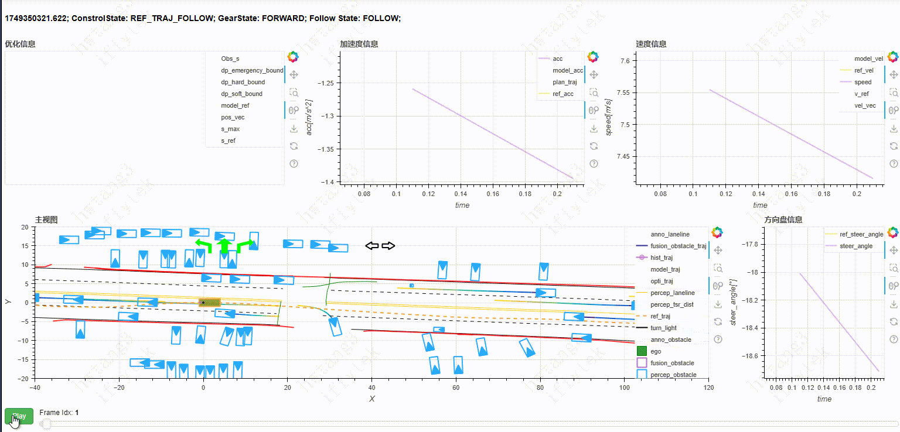

cut_in避让超车：


cut_in让行：

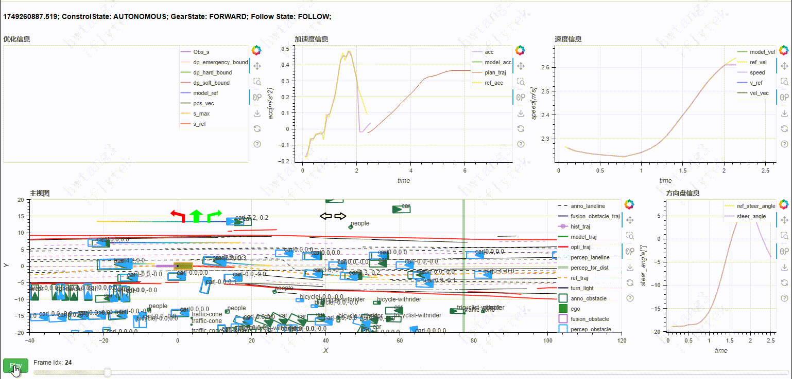

借道绕行：

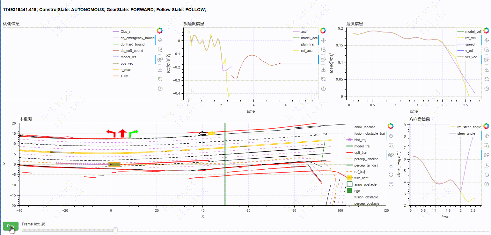

导航变道：

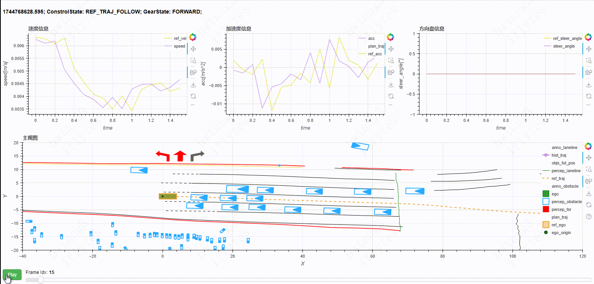

效率变道：


拨杆变道：

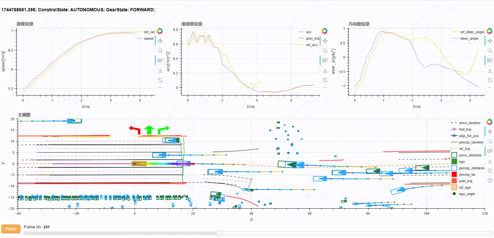

下匝道：


上匝道：

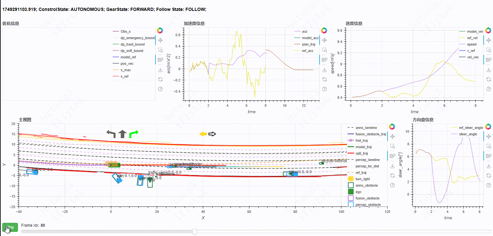

#### 2.1.2 多决策时空联合交互优化
##### ① 问题背景
模型轨迹实车路测中存在以下问题，需要下游基于规则继续进行一轮优化，实现**丝滑**的**选道/变道决策**以及**安全/舒适/高效/合规**的轨迹规划：

拨杆变道响应慢：

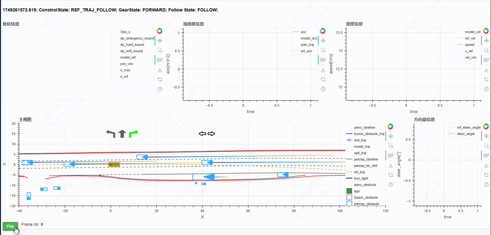

导航变道发起晚：

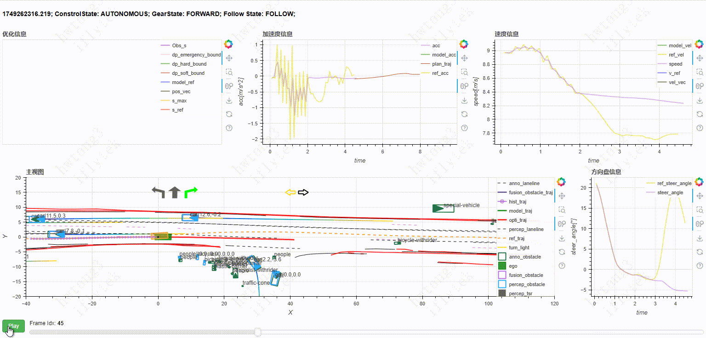

实线变道：

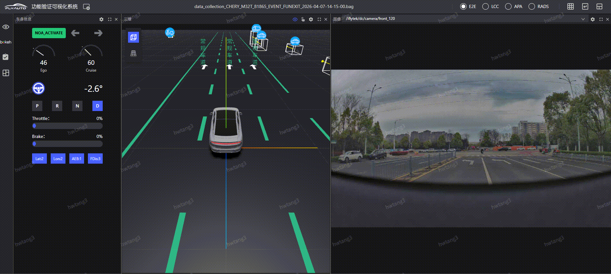

变道返回碰撞风险：

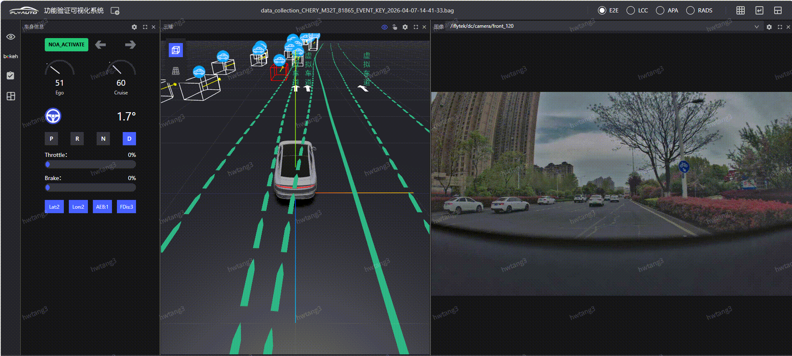

cut_in碰撞风险：

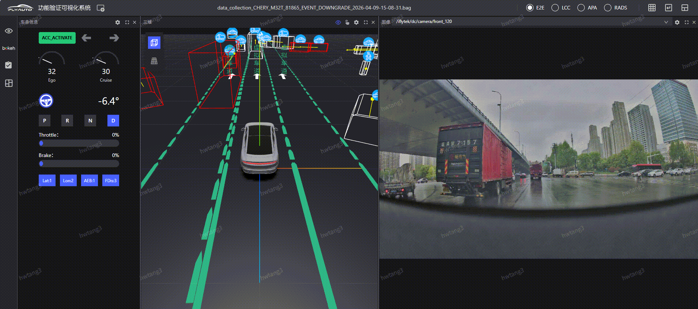

两侧车碰撞风险：

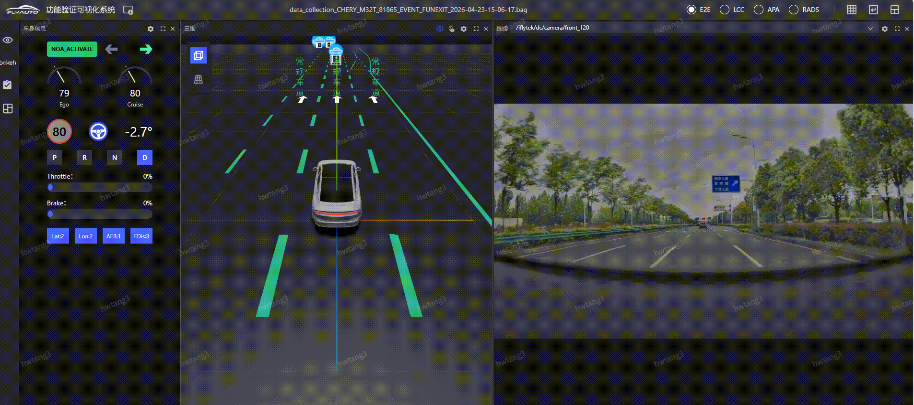

##### ② 多模态轨迹与场景构建
模型输出自车 $ N_R \times N_L $ 条多模态轨迹（横向参考线 × 纵向模态）及每个障碍物的 9 种决策概率和预测轨迹。

**核心思路**：多决策模块的主要作用是确定自车走哪条横向模态（参考线），然后对每个合理的横向模态分别做一轮联合优化，最终选最优规划轨迹下发。

###### 自车多模态轨迹
1. **横向模态筛选**：通过规则判断哪些横向模态是合理的候选（如：实线区域只保留 LaneKeep，最右车道不保留 LaneChangeRight），保留 2~3 个横向模态
2. **纵向模态选择**：对每个保留的横向模态，取该模态下模型评分最高的纵向轨迹作为自车先验参考轨迹

###### 障碍物多模态轨迹
+ 每个障碍物取 argmax 决策（最高概率）及其对应的预测轨迹
+ 纵向标签（LonIgnore/Overtake/Yield）：用于下游 iLQR 的纵向半平面约束方向
+ 横向标签（LatIgnore/NudgeLeft/NudgeRight）：用于确定障碍物相对自车的横向交互关系

###### 场景构建
每个合理的横向模态构成一个独立场景，各场景构造参考输入及边界约束，分别进入下游 iLQR 联合优化，最终按代价最小选择最优场景执行。

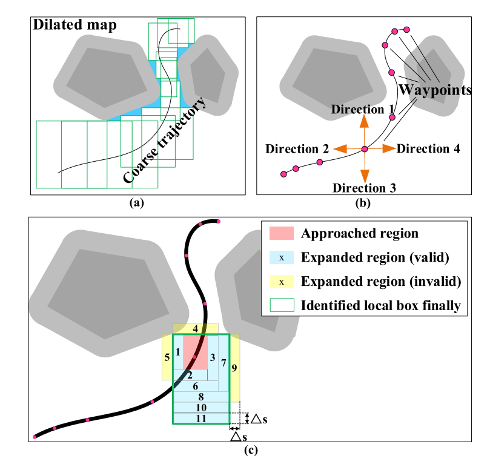

联合优化的输入：

| 输入项 | 来源 |
| --- | --- |
| 自车初始状态 $ (x,y,\theta,\delta,v,a) $ | 定位模块 |
| 自车参考轨迹 | 该横向模态下评分最高的纵向轨迹 |
| 道路边界（左/右） | 横向模态确定参考线 → 沿参考线查询车道边界 |
| 障碍物初始状态 $ (x,y,\theta,\delta,v,a) $ | 感知融合模块 |
| 障碍物参考轨迹 | argmax 预测轨迹 |
| 障碍物纵向标签 | LonIgnore/Overtake/Yield → 半平面纵向约束 |
| 障碍物横向标签 | LatIgnore/NudgeLeft/NudgeRight → 三圆盘横向避让 |
| 代价权重与约束参数 | 配置文件 |


> 相比全组合枚举（自车模态 × 障碍物决策的笛卡尔积），通过规则约束自车横向 + 障碍物取 argmax 保证实时性
>

车道保持场景：

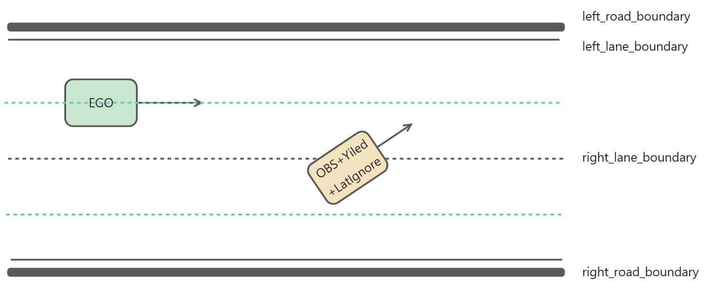

变道场景：

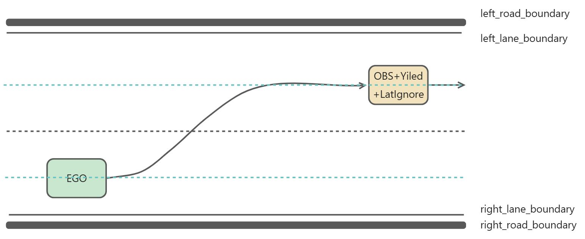

参考文献：

+ [1] EPSILON: An Efficient Planning System for Automated Vehicles in Highly Interactive Environments [https://arxiv.org/abs/2003.01758](https://arxiv.org/abs/2003.01758)
+ [2] MARC: Multipolicy and Risk-aware Contingency Planning for Autonomous Driving [https://arxiv.org/abs/2308.01528](https://arxiv.org/abs/2308.01528)
+ [3] Automated Tactical Maneuver Discovery, Reasoning and Trajectory Planning for Autonomous Driving [https://arxiv.org/abs/2011.07694](https://arxiv.org/abs/2011.07694)

##### ③ 联合优化问题构建
###### 自车运动学模型
状态变量：$ x, y, \theta, \delta, v, a $（6维）  
控制变量：$ \omega $（转向角速度）, $ j $（加加速度）（2维）  
常量：$ K = 1/L $（轴距倒数）


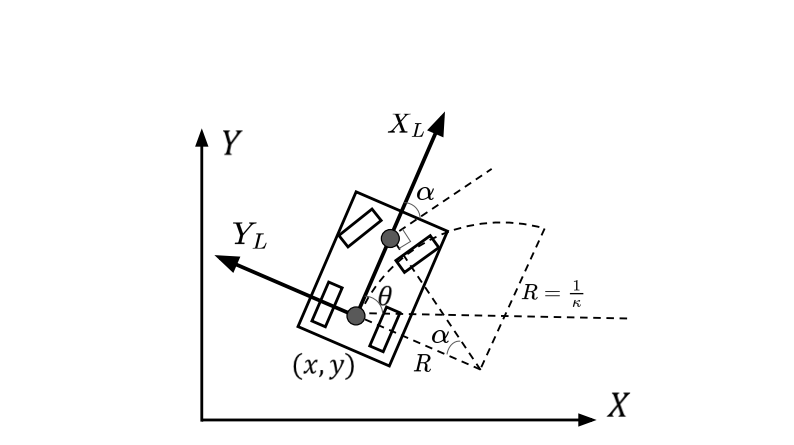

使用中间时刻航向角（减少线性近似误差）：

$ \theta_{mid} = \theta_i + \frac{1}{2} K v_i \delta_i \Delta t + \frac{1}{8} K v_i \omega \Delta t^2 $

位移增量（三阶积分）：

$ ds = \max\left(0,\; v_i \Delta t + \frac{1}{2} a_i \Delta t^2 + \frac{1}{6} j \Delta t^3\right) $

状态更新方程：

$ x_{i+1} = x_i + ds \cdot \cos(\theta_{mid}) $

$ y_{i+1} = y_i + ds \cdot \sin(\theta_{mid}) $

$ \theta_{i+1} = \theta_i + K v_i \delta_i \Delta t + \frac{1}{2} K v_i \omega \Delta t^2 $

$ \delta_{i+1} = \delta_i + \omega \Delta t $

$ v_{i+1} = \max(0,\; v_i + a_i \Delta t + \frac{1}{2} j \Delta t^2) $

$ a_{i+1} = a_i + j \Delta t $


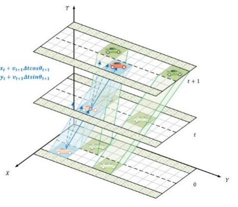

---

###### 他车运动学模型
状态变量：$ x^{(i)}, y^{(i)}, \theta^{(i)}, \delta^{(i)}, v^{(i)}, a^{(i)} $（6维）  
控制变量：$ \omega^{(i)} $（转向角速度）, $ j^{(i)} $（加加速度）（2维）

中间时刻航向角：

$ \theta^{(i)}_{mid} = \theta^{(i)} + \frac{1}{2} K_i v^{(i)} \delta^{(i)} \Delta t + \frac{1}{8} K_i v^{(i)} \omega^{(i)} \Delta t^2 $

位移增量：

$ ds_i = \max\left(0,\; v^{(i)} \Delta t + \frac{1}{2} a^{(i)} \Delta t^2 + \frac{1}{6} j^{(i)} \Delta t^3\right) $

###### 状态更新方程
$ x^{(i)}_{t+1} = x^{(i)}_t + ds_i \cdot \cos(\theta^{(i)}_{mid}) $

$ y^{(i)}_{t+1} = y^{(i)}_t + ds_i \cdot \sin(\theta^{(i)}_{mid}) $

$ \theta^{(i)}_{t+1} = \theta^{(i)}_t + K_i v^{(i)} \delta^{(i)} \Delta t + \frac{1}{2} K_i v^{(i)} \omega^{(i)} \Delta t^2 $

$ \delta^{(i)}_{t+1} = \delta^{(i)}_t + \omega^{(i)} \Delta t $

$ v^{(i)}_{t+1} = \max(0,\; v^{(i)} + a^{(i)} \Delta t + \frac{1}{2} j^{(i)} \Delta t^2) $

$ a^{(i)}_{t+1} = a^{(i)} + j^{(i)} \Delta t $


> 说明：他车与自车使用**同构**的运动学模型（均为6D状态+2D控制），区别仅在于曲率因子 $ K_i $ 可能不同（不同轴距。
>

---

使用AL-iLQR 框架构建联合优化问题：

✅ **状态向量** $ X $

$ X = \begin{bmatrix} x \\ y \\ \theta \\ \delta \\ v \\ a \\ x^{(1)} \\ y^{(1)} \\ \theta^{(1)} \\ \delta^{(1)} \\ v^{(1)} \\ a^{(1)} \\ \vdots \\ x^{(N)} \\ y^{(N)} \\ \theta^{(N)} \\ \delta^{(N)} \\ v^{(N)} \\ a^{(N)} \end{bmatrix} \in \mathbb{R}^{6 + 6N} $

+ $ x, y $: 自车位置 [m]
+ $ \theta $: 自车航向角 [rad]
+ $ \delta $: 自车转向角 [rad]
+ $ v $: 自车速度 [m/s]
+ $ a $: 自车加速度 [m/s²]
+ $ x^{(i)}, y^{(i)}, \theta^{(i)}, \delta^{(i)}, v^{(i)}, a^{(i)} $: 第 $ i $ 辆他车的状态

---

✅ **控制向量** $ U $

$ U = \begin{bmatrix} \omega \\ j \\ \omega^{(1)} \\ j^{(1)} \\ \vdots \\ \omega^{(N)} \\ j^{(N)} \end{bmatrix} \in \mathbb{R}^{2 + 2N} $

+ $ \omega $: 自车转向角速度 [rad/s]
+ $ j $: 自车加加速度 [m/s³]
+ $ \omega^{(i)}, j^{(i)} $: 第 $ i $ 辆他车的控制输入（转向角速度/加加速度）

---

✅ **状态空间表达式（以1个交互障碍物为例）**

系统模型为非线性离散形式，在当前工作点线性化：

$ X_1 \approx A \cdot X_0 + B \cdot U_0 $

状态变量向量 $ X_0 \in \mathbb{R}^{12} $：

$ X_0 = \begin{bmatrix} x \\ y \\ \theta \\ \delta \\ v \\ a \\ x^{(1)} \\ y^{(1)} \\ \theta^{(1)} \\ \delta^{(1)} \\ v^{(1)} \\ a^{(1)} \end{bmatrix} $

+ 前 6 项为自车状态
+ 后 6 项为他车状态

控制变量向量 $ U_0 \in \mathbb{R}^{4} $：

$ U_0 = \begin{bmatrix} \omega \\ j \\ \omega^{(1)} \\ j^{(1)} \end{bmatrix} $

+ 前 2 项为自车控制输入
+ 后 2 项为他车控制输入

---

**中间变量定义**（自车）：

$ ds = v \Delta t + \frac{1}{2} a \Delta t^2 + \frac{1}{6} j \Delta t^3 $

$ \theta_{mid} = \theta + \frac{1}{2} K v \delta \Delta t + \frac{1}{8} K v \omega \Delta t^2 $

$ k_{vt} = \frac{\partial \theta_{mid}}{\partial \delta} = \frac{1}{2} K v \Delta t $

$ k_{\delta t} = \frac{\partial \theta_{mid}}{\partial v} = \frac{1}{2} K \delta \Delta t $

$ k_{\omega t} = \frac{\partial \theta_{mid}}{\partial \omega} = \frac{1}{8} K v \Delta t^2 $


---

✅ **状态转移矩阵** $ A \in \mathbb{R}^{12 \times 12} $

$ A = \begin{bmatrix} A_{ego} &0_{6\times6} \\ 0_{6\times6} & A_{obs} \end{bmatrix} $

其中自车块 $ A_{ego} \in \mathbb{R}^{6 \times 6} $：

$ A_{ego} = \begin{bmatrix} 1 & 0 & -ds\sin\theta_{mid} & -ds\sin\theta_{mid} \cdot k_{vt} &\Delta t\cos\theta_{mid} - \Delta t v k_{\delta t}\sin\theta_{mid} &\frac{1}{2}\Delta t^2\cos\theta_{mid} \\ 0 & 1 &ds\cos\theta_{mid} &ds\cos\theta_{mid} \cdot k_{vt} &\Delta t\sin\theta_{mid} + \Delta t v k_{\delta t}\cos\theta_{mid} & \frac{1}{2}\Delta t^2\sin\theta_{mid} \\ 0 & 0 & 1 & Kv\Delta t &K\delta\Delta t & 0 \\ 0 & 0 & 0 & 1 & 0 &0 \\ 0 & 0 & 0 & 0 & 1 & \Delta t \\ 0 & 0 & 0 & 0 & 0 & 1 \end{bmatrix} $

他车块 $ A_{obs} \in \mathbb{R}^{6 \times 6} $ 结构完全相同，仅将自车变量替换为对应他车变量：

$ A_{obs} = \begin{bmatrix} 1 & 0 & -ds_i\sin\theta^{(i)}_{mid} & -ds_i\sin\theta^{(i)}_{mid} \cdot k^{(i)}_{vt} & \Delta t\cos\theta^{(i)}_{mid} - \Delta t v^{(i)} k^{(i)}_{\delta t}\sin\theta^{(i)}_{mid} & \frac{1}{2}\Delta t^2\cos\theta^{(i)}_{mid} \\ 0 & 1 & ds_i\cos\theta^{(i)}_{mid} &ds_i\cos\theta^{(i)}_{mid} \cdot k^{(i)}_{vt} & \Delta t\sin\theta^{(i)}_{mid} + \Delta t v^{(i)} k^{(i)}_{\delta t}\cos\theta^{(i)}_{mid} & \frac{1}{2}\Delta t^2\sin\theta^{(i)}_{mid} \\ 0 & 0 & 1 & K_i v^{(i)}\Delta t &K_i\delta^{(i)}\Delta t & 0 \\ 0 & 0 & 0 & 1 & 0 & 0 \\ 0 & 0 & 0 & 0 & 1 &\Delta t \\ 0 & 0 & 0 & 0 & 0 & 1 \end{bmatrix} $

> 注：$ A $ 为块对角矩阵，自车与他车的动力学在状态传播层面解耦。
>

---

✅ **控制转移矩阵** $ B \in \mathbb{R}^{12 \times 4} $

$ B = \begin{bmatrix} B_{ego} & 0_{6\times2} \\ 0_{6\times2} & B_{obs} \end{bmatrix} $

其中自车块 $ B_{ego} \in \mathbb{R}^{6 \times 2} $：

$ B_{ego} = \begin{bmatrix} -ds\sin\theta_{mid} \cdot k_{\omega t} & \frac{1}{6}\Delta t^3\cos\theta_{mid} \\ ds\cos\theta_{mid} \cdot k_{\omega t} & \frac{1}{6}\Delta t^3\sin\theta_{mid} \\ \frac{1}{2}Kv\Delta t^2 & 0 \\ \Delta t & 0 \\ 0 & \frac{1}{2}\Delta t^2 \\ 0 & \Delta t \end{bmatrix} $

他车块 $ B_{obs} \in \mathbb{R}^{6 \times 2} $：

$ B_{obs} = \begin{bmatrix} -ds_i\sin\theta^{(i)}_{mid} \cdot k^{(i)}_{\omega t} & \frac{1}{6}\Delta t^3\cos\theta^{(i)}_{mid} \\ ds_i\cos\theta^{(i)}_{mid} \cdot k^{(i)}_{\omega t} & \frac{1}{6}\Delta t^3\sin\theta^{(i)}_{mid} \\ \frac{1}{2}K_i v^{(i)}\Delta t^2 & 0 \\ \Delta t & 0 \\ 0 & \frac{1}{2}\Delta t^2 \\ 0 & \Delta t \end{bmatrix} $

**代码实现**

```cpp
#include "joint_motion_planning_model.h"
#include "joint_motion_planning_cost.h"

using namespace pnc::mathlib;
static constexpr double kOneSix = 1.0 / 6.0;
static constexpr double kHalf = 1.0 / 2.0;
static constexpr double kOneEighth = 1.0 / 8.0;

namespace pnc {
namespace joint_motion_planning {

ilqr_solver::State JointMotionPlanningModel::UpdateDynamicsOneStep(
    const ilqr_solver::State &x0, const ilqr_solver::Control &u,
    const size_t &step) const {
  const double dt = solver_config_ptr_->model_dt;
  const ilqr_solver::IlqrCostConfig &cost_config =
      cost_config_vec_ptr_->at(step);
  ilqr_solver::State x1 = x0;
  x1.setZero();
  const auto dt2 = dt * dt;
  const auto dt3 = dt2 * dt;

  const auto &x0_x = x0[EGO_X];
  const auto &x0_y = x0[EGO_Y];
  const auto &x0_theta = x0[EGO_THETA];
  const auto &x0_delta = x0[EGO_DELTA];
  const auto &x0_vel = x0[EGO_VEL];
  const auto &x0_acc = x0[EGO_ACC];
  const double curv_factor = cost_config[CURV_FACTOR];
  const auto &u_omega = u[EGO_OMEGA];
  const auto &u_jerk = u[EGO_JERK];

  const double theta_mid = x0_theta +
      kHalf * curv_factor * x0_delta * x0_vel * dt +
      kOneEighth * curv_factor * u_omega * x0_vel * dt2;
  const double cos_theta = std::cos(theta_mid);
  const double sin_theta = std::sin(theta_mid);
  const double d_s = std::max(
      0.0, x0_vel * dt + kHalf * x0_acc * dt2 + kOneSix * u_jerk * dt3);

  x1[EGO_X] = x0_x + d_s * cos_theta;
  x1[EGO_Y] = x0_y + d_s * sin_theta;
  x1[EGO_THETA] = x0_theta + curv_factor * x0_delta * x0_vel * dt +
                  kHalf * curv_factor * u_omega * x0_vel * dt2;
  x1[EGO_DELTA] = x0_delta + u_omega * dt;
  x1[EGO_VEL] = std::max(0.0, x0_vel + x0_acc * dt + kHalf * u_jerk * dt2);
  x1[EGO_ACC] = x0_acc + u_jerk * dt;

  const int obs_num = static_cast<int>(cost_config[OBS_NUM]);
  for (int i = 0; i < obs_num; ++i) {
    const int s_offset = GetObsStateIdx(i, 0);
    const int c_offset = GetObsControlIdx(i, 0);

    const double obs_x = x0[s_offset + OBS_X];
    const double obs_y = x0[s_offset + OBS_Y];
    const double obs_theta = x0[s_offset + OBS_THETA];
    const double obs_delta = x0[s_offset + OBS_DELTA];
    const double obs_vel = x0[s_offset + OBS_VEL];
    const double obs_acc = x0[s_offset + OBS_ACC];

    const double obs_omega = u[c_offset + OBS_OMEGA];
    const double obs_jerk = u[c_offset + OBS_JERK];

    const double k_obs = cost_config[GetObsCurvFactorIdx(i)];

    const double obs_theta_mid = obs_theta +
        kHalf * k_obs * obs_delta * obs_vel * dt +
        kOneEighth * k_obs * obs_omega * obs_vel * dt2;
    const double obs_cos = std::cos(obs_theta_mid);
    const double obs_sin = std::sin(obs_theta_mid);
    const double obs_ds = std::max(
        0.0, obs_vel * dt + kHalf * obs_acc * dt2 + kOneSix * obs_jerk * dt3);

    x1[s_offset + OBS_X] = obs_x + obs_ds * obs_cos;
    x1[s_offset + OBS_Y] = obs_y + obs_ds * obs_sin;
    x1[s_offset + OBS_THETA] = obs_theta + k_obs * obs_delta * obs_vel * dt +
                               kHalf * k_obs * obs_omega * obs_vel * dt2;
    x1[s_offset + OBS_DELTA] = obs_delta + obs_omega * dt;
    x1[s_offset + OBS_VEL] = std::max(
        0.0, obs_vel + obs_acc * dt + kHalf * obs_jerk * dt2);
    x1[s_offset + OBS_ACC] = obs_acc + obs_jerk * dt;
  }
  return x1;
}

void JointMotionPlanningModel::GetDynamicsDerivatives(
    const ilqr_solver::State &x0, const ilqr_solver::Control &u,
    ilqr_solver::FxMT &f_x, ilqr_solver::FuMT &f_u,
    const size_t &step) const {
  const double dt = solver_config_ptr_->model_dt;
  const ilqr_solver::IlqrCostConfig &cost_config =
      cost_config_vec_ptr_->at(step);
  const int obs_num = static_cast<int>(cost_config[OBS_NUM]);
  const int total_state_size = EGO_STATE_SIZE + OBS_STATE_SIZE * obs_num;
  const int total_control_size = EGO_CONTROL_SIZE + OBS_CONTROL_SIZE * obs_num;

  f_x.setZero(total_state_size, total_state_size);
  f_u.setZero(total_state_size, total_control_size);

  const auto dt2 = dt * dt;
  const auto dt3 = dt2 * dt;

  const auto &x0_theta = x0[EGO_THETA];
  const auto &x0_delta = x0[EGO_DELTA];
  const auto &x0_vel = x0[EGO_VEL];
  const auto &x0_acc = x0[EGO_ACC];
  const double k = cost_config[CURV_FACTOR];
  const auto &u_omega = u[EGO_OMEGA];
  const auto &u_jerk = u[EGO_JERK];

  const double theta_mid = x0_theta + kHalf * k * x0_delta * x0_vel * dt +
                           kOneEighth * k * u_omega * x0_vel * dt2;
  const double cos_theta = std::cos(theta_mid);
  const double sin_theta = std::sin(theta_mid);
  const double d_s = std::max(
      0.0, x0_vel * dt + kHalf * x0_acc * dt2 + kOneSix * u_jerk * dt3);
  const double k_delta_t = kHalf * k * x0_delta * dt;
  const double k_omega_t = kOneEighth * k * x0_vel * dt2;

  // df_ego/dx_ego (6x6)
  f_x.block(0, 0, EGO_STATE_SIZE, EGO_STATE_SIZE) <<
      1.0, 0.0, -d_s * sin_theta,
      -d_s * sin_theta * kHalf * k * x0_vel * dt,
      dt * cos_theta - dt * x0_vel * k_delta_t * sin_theta,
      kHalf * dt2 * cos_theta,
      0.0, 1.0, d_s * cos_theta,
      d_s * cos_theta * kHalf * k * x0_vel * dt,
      dt * sin_theta + dt * x0_vel * k_delta_t * cos_theta,
      kHalf * dt2 * sin_theta,
      0.0, 0.0, 1.0, k * x0_vel * dt, k * x0_delta * dt, 0.0,
      0.0, 0.0, 0.0, 1.0, 0.0, 0.0,
      0.0, 0.0, 0.0, 0.0, 1.0, dt,
      0.0, 0.0, 0.0, 0.0, 0.0, 1.0;

  f_u.block(0, 0, EGO_STATE_SIZE, EGO_CONTROL_SIZE) <<
      -d_s * sin_theta * k_omega_t, kOneSix * dt3 * cos_theta,
      d_s * cos_theta * k_omega_t, kOneSix * dt3 * sin_theta,
      kHalf * k * x0_vel * dt2, 0.0,
      dt, 0.0,
      0.0, kHalf * dt2,
      0.0, dt;

  for (int i = 0; i < obs_num; ++i) {
    const int s_offset = GetObsStateIdx(i, 0);
    const int c_offset = GetObsControlIdx(i, 0);

    const double obs_theta = x0[s_offset + OBS_THETA];
    const double obs_delta = x0[s_offset + OBS_DELTA];
    const double obs_vel = x0[s_offset + OBS_VEL];
    const double obs_acc = x0[s_offset + OBS_ACC];
    const double obs_omega = u[c_offset + OBS_OMEGA];
    const double obs_jerk = u[c_offset + OBS_JERK];
    const double k_obs = cost_config[GetObsCurvFactorIdx(i)];

    const double obs_theta_mid = obs_theta +
        kHalf * k_obs * obs_delta * obs_vel * dt +
        kOneEighth * k_obs * obs_omega * obs_vel * dt2;
    const double obs_cos = std::cos(obs_theta_mid);
    const double obs_sin = std::sin(obs_theta_mid);
    const double obs_ds = std::max(
        0.0, obs_vel * dt + kHalf * obs_acc * dt2 + kOneSix * obs_jerk * dt3);
    const double obs_k_delta_t = kHalf * k_obs * obs_delta * dt;
    const double obs_k_omega_t = kOneEighth * k_obs * obs_vel * dt2;

    f_x.block(s_offset, s_offset, OBS_STATE_SIZE, OBS_STATE_SIZE) <<
        1.0, 0.0, -obs_ds * obs_sin,
        -obs_ds * obs_sin * kHalf * k_obs * obs_vel * dt,
        dt * obs_cos - dt * obs_vel * obs_k_delta_t * obs_sin,
        kHalf * dt2 * obs_cos,
        0.0, 1.0, obs_ds * obs_cos,
        obs_ds * obs_cos * kHalf * k_obs * obs_vel * dt,
        dt * obs_sin + dt * obs_vel * obs_k_delta_t * obs_cos,
        kHalf * dt2 * obs_sin,
        0.0, 0.0, 1.0, k_obs * obs_vel * dt, k_obs * obs_delta * dt, 0.0,
        0.0, 0.0, 0.0, 1.0, 0.0, 0.0,
        0.0, 0.0, 0.0, 0.0, 1.0, dt,
        0.0, 0.0, 0.0, 0.0, 0.0, 1.0;

    f_u.block(s_offset, c_offset, OBS_STATE_SIZE, OBS_CONTROL_SIZE) <<
        -obs_ds * obs_sin * obs_k_omega_t, kOneSix * dt3 * obs_cos,
        obs_ds * obs_cos * obs_k_omega_t, kOneSix * dt3 * obs_sin,
        kHalf * k_obs * obs_vel * dt2, 0.0,
        dt, 0.0,
        0.0, kHalf * dt2,
        0.0, dt;
  }
}

}  // namespace joint_motion_planning
}  // namespace pnc
```

##### ④ cost设计
总代价函数为各代价项的加权和：

$ J = \sum_{k=0}^{N} \left[ J_{ref}(k) + J_{safe}(k) + J_{comfort}(k) + J_{bound}(k) \right] $

其中 $ N=25 $（时域步数），$ \Delta t = 0.2s $（步长），总规划时域 5s。


###### 代价项汇总
| 类别 | 代价项 | 公式形式 | 作用对象 |
| --- | --- | --- | --- |
| **目标代价** | ReferenceCostTerm | $ \frac{1}{2}w(x-x_{ref})^2 $ | 自车+障碍物状态 |
| **安全代价** | ThreeDiscSafeCostTerm | $ w(e^{violation}-1) $ | 自车-障碍物耦合 |
| **安全代价** | RoadBoundaryCostTerm | $ w(e^{violation}-1) $ | 自车+障碍物状态 |
| **安全代价** | LaneBoundaryCostTerm | $ w(e^{violation}-1) $ | 自车状态 |
| **安全代价** | SoftHalfplaneCostTerm | $ w(s-s_{target})^2 $ | 自车-障碍物耦合 |
| **安全代价** | HardHalfplaneCostTerm | $ w(s-d_{hard})^2 $ | 自车-障碍物耦合 |
| **舒适代价** | AccCostTerm | $ \frac{1}{2}w \cdot a^2 $ | 状态 $ l_x, l_{xx} $ |
| **舒适代价** | JerkCostTerm | $ \frac{1}{2}w \cdot j^2 $ | 控制 $ l_u, l_{uu} $ |
| **舒适代价** | LatAccCostTerm | $ \frac{1}{2}w K^2 v^4 \delta^2 $ | 状态 $ l_x, l_{xx} $ |
| **舒适代价** | LatJerkCostTerm | $ \frac{1}{2}w K^2 v^4 \omega^2 $ | 状态+控制 |
| **状态约束** | AccBoundCostTerm | $ w \cdot violation^2 $ | 状态 $ l_x, l_{xx} $ |
| **状态约束** | JerkBoundCostTerm | $ w \cdot violation^2 $ | 控制 $ l_u, l_{uu} $ |
| **状态约束** | DeltaBoundCostTerm | $ w \cdot violation^2 $ | 状态 $ l_x, l_{xx} $ |
| **状态约束** | OmegaBoundCostTerm | $ w \cdot violation^2 $ | 控制 $ l_u, l_{uu} $ |


---

###### 参考轨迹跟踪代价（ReferenceCostTerm）
**目标**：使自车和障碍物状态分别跟踪各自的参考轨迹（自车跟 IDM+PurePursuit 先验轨迹，障碍物跟预测轨迹）。

$ J_{ref} = \frac{1}{2} \sum_{i \in \{x,y,\theta,\delta,v,a\}} w_i^{ego} (x_i^{ego} - x_i^{ref,ego})^2 + \frac{1}{2} \sum_{j=1}^{N_{obs}} \sum_{i \in \{x,y,\theta,\delta,v,a\}} w_i^{obs} (x_i^{(j)} - x_i^{ref,(j)})^2 $

**Jacobian**：

$ \frac{\partial J_{ref}}{\partial x_i} = w_i (x_i - x_i^{ref}) $

**Hessian**：

$ \frac{\partial^2 J_{ref}}{\partial x_i^2} = w_i $

> 对角 Hessian，无交叉项。自车和障碍物各自独立跟踪，无耦合。
>

```cpp
double ReferenceCostTerm::GetCost(const ilqr_solver::State &x,
                                  const ilqr_solver::Control &) {
  double cost = 0.0;
  cost += 0.5 * cost_config_ptr_->at(W_EGO_REF_X) *
          std::pow(x[EGO_X] - cost_config_ptr_->at(EGO_REF_X), 2);
  cost += 0.5 * cost_config_ptr_->at(W_EGO_REF_Y) *
          std::pow(x[EGO_Y] - cost_config_ptr_->at(EGO_REF_Y), 2);
  cost += 0.5 * cost_config_ptr_->at(W_EGO_REF_THETA) *
          std::pow(x[EGO_THETA] - cost_config_ptr_->at(EGO_REF_THETA), 2);
  cost += 0.5 * cost_config_ptr_->at(W_EGO_REF_DELTA) *
          std::pow(x[EGO_DELTA] - cost_config_ptr_->at(EGO_REF_DELTA), 2);
  cost += 0.5 * cost_config_ptr_->at(W_EGO_REF_VEL) *
          std::pow(x[EGO_VEL] - cost_config_ptr_->at(EGO_REF_VEL), 2);
  cost += 0.5 * cost_config_ptr_->at(W_EGO_REF_ACC) *
          std::pow(x[EGO_ACC] - cost_config_ptr_->at(EGO_REF_ACC), 2);

  const int obs_num = static_cast<int>(cost_config_ptr_->at(OBS_NUM));
  for (int i = 0; i < obs_num; ++i) {
    const int base = GetObsStateIdx(i, OBS_X);
    for (int s = 0; s < OBS_STATE_SIZE; ++s) {
      const int ref_idx = GetObsRefStateIdx(i, obs_num, s);
      const double w = cost_config_ptr_->at(W_OBS_REF_START + s);
      cost += 0.5 * w * std::pow(x[base + s] - cost_config_ptr_->at(ref_idx), 2);
    }
  }
  return cost;
}

void ReferenceCostTerm::GetGradientHessian(
    const ilqr_solver::State &x, const ilqr_solver::Control &,
    ilqr_solver::LxMT &lx, ilqr_solver::LuMT &, ilqr_solver::LxxMT &lxx,
    ilqr_solver::LxuMT &, ilqr_solver::LuuMT &) {
  lx(EGO_X) += cost_config_ptr_->at(W_EGO_REF_X) *
               (x[EGO_X] - cost_config_ptr_->at(EGO_REF_X));
  lx(EGO_Y) += cost_config_ptr_->at(W_EGO_REF_Y) *
               (x[EGO_Y] - cost_config_ptr_->at(EGO_REF_Y));
  lx(EGO_THETA) += cost_config_ptr_->at(W_EGO_REF_THETA) *
                   (x[EGO_THETA] - cost_config_ptr_->at(EGO_REF_THETA));
  lx(EGO_DELTA) += cost_config_ptr_->at(W_EGO_REF_DELTA) *
                   (x[EGO_DELTA] - cost_config_ptr_->at(EGO_REF_DELTA));
  lx(EGO_VEL) += cost_config_ptr_->at(W_EGO_REF_VEL) *
                 (x[EGO_VEL] - cost_config_ptr_->at(EGO_REF_VEL));
  lx(EGO_ACC) += cost_config_ptr_->at(W_EGO_REF_ACC) *
                 (x[EGO_ACC] - cost_config_ptr_->at(EGO_REF_ACC));
  lxx(EGO_X, EGO_X) += cost_config_ptr_->at(W_EGO_REF_X);
  lxx(EGO_Y, EGO_Y) += cost_config_ptr_->at(W_EGO_REF_Y);
  lxx(EGO_THETA, EGO_THETA) += cost_config_ptr_->at(W_EGO_REF_THETA);
  lxx(EGO_DELTA, EGO_DELTA) += cost_config_ptr_->at(W_EGO_REF_DELTA);
  lxx(EGO_VEL, EGO_VEL) += cost_config_ptr_->at(W_EGO_REF_VEL);
  lxx(EGO_ACC, EGO_ACC) += cost_config_ptr_->at(W_EGO_REF_ACC);

  const int obs_num = static_cast<int>(cost_config_ptr_->at(OBS_NUM));
  for (int i = 0; i < obs_num; ++i) {
    const int base = GetObsStateIdx(i, OBS_X);
    for (int s = 0; s < OBS_STATE_SIZE; ++s) {
      const int state_idx = base + s;
      const int ref_idx = GetObsRefStateIdx(i, obs_num, s);
      const double w = cost_config_ptr_->at(W_OBS_REF_START + s);
      lx(state_idx) += w * (x[state_idx] - cost_config_ptr_->at(ref_idx));
      lxx(state_idx, state_idx) += w;
    }
  }
}
```

---

###### 三圆盘安全代价（ThreeDiscSafeCostTerm）
**目标**：避免自车与需要横向避让的障碍物碰撞。使用多圆盘模型近似车辆轮廓。

**生效条件**：仅对横向标签为 NudgeLeft/NudgeRight 的障碍物计算三圆盘代价（即需要横向避让的障碍物）。LatIgnore 标签的障碍物不参与三圆盘碰撞检测。

**多圆盘模型**：

    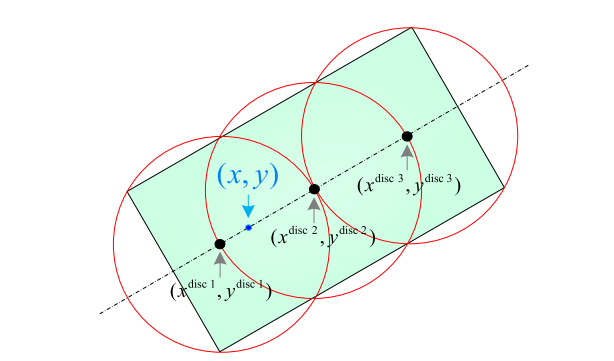   

+ 自车：3 个圆盘，中心沿车身纵轴分布于 $ L, 3L, 5L $（$ L = \text{length}/6 $），半径 $ r_{ego} = \sqrt{L^2 + (w/2)^2} $
+ 障碍物：动态圆盘数（基于长宽比 $ n = \min(6, \max(2, 2 \cdot l/w)) $），半径 $ r_{obs} = \sqrt{(l/(2n))^2 + (w/2)^2} $

**代价函数**（指数障碍函数）：

$ J_{safe} = w \cdot (e^{d_{safe} - d_{min}} - 1) \quad \text{when } d_{min} \lt d_{safe}, \quad 0 \text{ otherwise} $

**Jacobian**：

设最近圆盘对的自车圆盘中心 $ (p_x, p_y) $，偏移量 $ o_j $，单位方向向量 $ \vec{u} $：

$ \frac{\partial J}{\partial x_i} = -w \cdot e^{d_{safe} - d_{min}} \cdot \frac{\partial d_{min}}{\partial x_i} $

其中 $ \frac{\partial d}{\partial x} = u_x $，$ \frac{\partial d}{\partial y} = u_y $，$ \frac{\partial d}{\partial \theta} = u_x(-o_j\sin\theta) + u_y(o_j\cos\theta) $

**Hessian**：

$ \frac{\partial^2 J}{\partial x_i \partial x_j} = w \cdot e^{violation} \left( \frac{\partial d}{\partial x_i} \frac{\partial d}{\partial x_j} - \frac{\partial^2 d}{\partial x_i \partial x_j} \right) $

> 权重随时域指数衰减：$ w(k) = w_0 \cdot e^{-0.1k} $
>

**参数定义：**


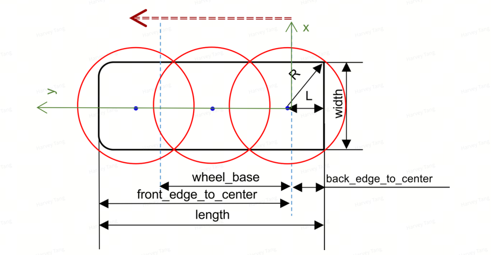

**代码实现：**

```cpp
EgoThreeDiscSafeCostTerm::ThreeDiscResult
EgoThreeDiscSafeCostTerm::CalculateThreeDiscDistances(
    const ilqr_solver::State &x) {
  auto calc_three_centers = [](double x, double y, double theta, double length,
                               bool is_ego = true) {
    double L = length / 6;
    double backcenter = is_ego ? L : 3 * L;
    double cos_theta = std::cos(theta);
    double sin_theta = std::sin(theta);
    std::array<double, 3> offsets = {L - backcenter, 3 * L - backcenter,
                                     5 * L - backcenter};
    std::array<std::pair<double, double>, 3> centers;
    for (int i = 0; i < 3; ++i) {
      centers[i] = {x + offsets[i] * cos_theta,
                    y + offsets[i] * sin_theta};
    }
    return centers;
  };

  auto calc_disc_num = [](double length, double width) {
    double aspect_ratio = length / width;
    int disc_num = std::max(2, static_cast<int>(aspect_ratio * 2));
    return std::min(disc_num, 6);
  };

  auto calc_dynamic_centers = [](double x, double y, double theta,
                                 double length, int disc_num,
                                 bool is_ego = false) {
    double segment_length = length / disc_num;
    double backcenter = is_ego ? segment_length / 2 : length / 2;

    std::vector<std::pair<double, double>> centers;
    centers.reserve(disc_num);

    double cos_theta = std::cos(theta);
    double sin_theta = std::sin(theta);

    for (int i = 0; i < disc_num; ++i) {
      double offset = (i + 0.5) * segment_length - backcenter;
      double center_x = x + offset * cos_theta;
      double center_y = y + offset * sin_theta;
      centers.push_back({center_x, center_y});
    }
    return centers;
  };

  auto calc_radius = [](double length, double width) {
    return sqrt(pow(length / 6, 2) + pow(width / 2, 2));
  };

  auto calc_dynamic_radius = [](double length, double width, int disc_num) {
    return sqrt(pow(length / (2 * disc_num), 2) + pow(width / 2, 2));
  };
  auto calc_distance = [](double x1, double y1, double x2, double y2, double r1,
                          double r2) {
    return sqrt(pow(x1 - x2, 2) + pow(y1 - y2, 2)) - r1 - r2;
  };
  auto calc_distance_squared = [](double x1, double y1, double x2, double y2,
                                  double r1, double r2) {
    double dx = x1 - x2;
    double dy = y1 - y2;
    double center_dist_sq = dx * dx + dy * dy;
    return center_dist_sq;
  };
  const int obs_num = cost_config_ptr_->at(OBS_NUM);
  double min_dist_squared = std::numeric_limits<double>::max();
  double min_dist = std::numeric_limits<double>::max();
  double min_obs_x = 0.0, min_obs_y = 0.0, min_obs_radius = 0.0;
  int closest_obs_index = -1;
  double closest_ego_disc_x = 0.0, closest_ego_disc_y = 0.0;
  double closest_obs_disc_x = 0.0, closest_obs_disc_y = 0.0;
  int closest_ego_disc_index = -1;
  if (obs_num == 0) {
    min_obs_x = x[EGO_X];
    min_obs_y = x[EGO_Y];
    min_obs_radius = 0.0;
    min_dist = 0.0;
    return {min_dist,           min_obs_x,
            min_obs_y,          min_obs_radius,
            closest_obs_index,  closest_ego_disc_x,
            closest_ego_disc_y, closest_obs_disc_x,
            closest_obs_disc_y, closest_ego_disc_index};
  }
  double ego_length = cost_config_ptr_->at(EGO_LENGTH);
  double ego_width = cost_config_ptr_->at(EGO_WIDTH);
  double ego_x = x[EGO_X];
  double ego_y = x[EGO_Y];
  double ego_theta = x[EGO_THETA];

  auto ego_centers =
      calc_three_centers(ego_x, ego_y, ego_theta, ego_length, true);
  double ego_radius = calc_radius(ego_length, ego_width);

  for (int i = 0; i < obs_num; ++i) {
    const int ref_x_idx = GetObsRefStateIdx(i, obs_num, OBS_X);
    const int ref_y_idx = GetObsRefStateIdx(i, obs_num, OBS_Y);
    const int ref_theta_idx = GetObsRefStateIdx(i, obs_num, OBS_THETA);
    double obs_x = cost_config_ptr_->at(ref_x_idx);
    double obs_y = cost_config_ptr_->at(ref_y_idx);
    double obs_theta = cost_config_ptr_->at(ref_theta_idx);
    double obs_length = cost_config_ptr_->at(GetObsLengthIdx(i, obs_num));
    double obs_width = cost_config_ptr_->at(GetObsWidthIdx(i, obs_num));

    int obs_disc_num = calc_disc_num(obs_length, obs_width);
    auto obs_centers = calc_dynamic_centers(obs_x, obs_y, obs_theta, obs_length,
                                            obs_disc_num, false);
    double obs_radius =
        calc_dynamic_radius(obs_length, obs_width, obs_disc_num);

    for (int ego_disc_idx = 0; ego_disc_idx < 3; ++ego_disc_idx) {
      const auto &ego_c = ego_centers[ego_disc_idx];
      for (int obs_disc_idx = 0; obs_disc_idx < obs_disc_num; ++obs_disc_idx) {
        const auto &obs_c = obs_centers[obs_disc_idx];
        double dist_squared =
            calc_distance_squared(ego_c.first, ego_c.second, obs_c.first,
                                  obs_c.second, ego_radius, obs_radius);
        if (dist_squared < min_dist_squared) {
          min_dist_squared = dist_squared;
          min_dist = calc_distance(ego_c.first, ego_c.second, obs_c.first,
                                   obs_c.second, ego_radius, obs_radius);
          min_obs_x = obs_x;
          min_obs_y = obs_y;
          min_obs_radius = obs_radius;
          closest_obs_index = i;
          closest_ego_disc_x = ego_c.first;
          closest_ego_disc_y = ego_c.second;
          closest_obs_disc_x = obs_c.first;
          closest_obs_disc_y = obs_c.second;
          closest_ego_disc_index = ego_disc_idx;
        }
      }
    }
  }
  return {min_dist,           min_obs_x,
          min_obs_y,          min_obs_radius,
          closest_obs_index,  closest_ego_disc_x,
          closest_ego_disc_y, closest_obs_disc_x,
          closest_obs_disc_y, closest_ego_disc_index};
}

double EgoThreeDiscSafeCostTerm::GetCost(const ilqr_solver::State &x,
                                         const ilqr_solver::Control &u) {
  auto result = CalculateThreeDiscDistances(x);
  if (cost_config_ptr_->at(OBS_NUM) == 0) {
    return 0.0;
  }
  double safe_distance = cost_config_ptr_->at(THREE_DISC_SAFE_DIST);
  double weight = cost_config_ptr_->at(W_THREE_DISC_SAFE_DIST_WEIGHT);

  double cost = 0.0;
  if (result.min_dist < safe_distance) {
    double violation = safe_distance - result.min_dist;
    cost = weight * (std::exp(violation) - 1.0);
  }

  return cost;
}

void EgoThreeDiscSafeCostTerm::GetGradientHessian(
    const ilqr_solver::State &x, const ilqr_solver::Control &u,
    ilqr_solver::LxMT &lx, ilqr_solver::LuMT &lu, ilqr_solver::LxxMT &lxx,
    ilqr_solver::LxuMT &, ilqr_solver::LuuMT &luu) {
  auto result = CalculateThreeDiscDistances(x);
  if (cost_config_ptr_->at(OBS_NUM) == 0) {
    return;
  }
  double safe_distance = cost_config_ptr_->at(THREE_DISC_SAFE_DIST);
  double weight = cost_config_ptr_->at(W_THREE_DISC_SAFE_DIST_WEIGHT);

  if (result.min_dist >= safe_distance) {
    return;
  }

  double violation = safe_distance - result.min_dist;
  double gradient_coeff = -weight * std::exp(violation);
  double ego_length = cost_config_ptr_->at(EGO_LENGTH);
  double ego_theta = x[EGO_THETA];
  double rel_x = result.closest_ego_disc_x - result.closest_obs_disc_x;
  double rel_y = result.closest_ego_disc_y - result.closest_obs_disc_y;
  double rel_distance = std::sqrt(rel_x * rel_x + rel_y * rel_y);
  if (rel_distance < kEps) {
    return;
  }
  double unit_x = rel_x / rel_distance;
  double unit_y = rel_y / rel_distance;
  double L = ego_length / 6;
  double backcenter = L;
  std::array<double, 3> offsets = {L - backcenter, 3 * L - backcenter,
                                   5 * L - backcenter};
  double offset = offsets[result.closest_ego_disc_index];
  double dx_dego_x = 1.0;
  double dx_dego_y = 0.0;
  double dx_dego_theta = -offset * std::sin(ego_theta);
  double dy_dego_x = 0.0;
  double dy_dego_y = 1.0;
  double dy_dego_theta = offset * std::cos(ego_theta);
  double ddist_dego_x = unit_x * dx_dego_x + unit_y * dy_dego_x;
  double ddist_dego_y = unit_x * dx_dego_y + unit_y * dy_dego_y;
  double ddist_dego_theta = unit_x * dx_dego_theta + unit_y * dy_dego_theta;
  lx(EGO_X) += gradient_coeff * ddist_dego_x;
  lx(EGO_Y) += gradient_coeff * ddist_dego_y;
  lx(EGO_THETA) += gradient_coeff * ddist_dego_theta;
  double D3 = rel_distance * rel_distance * rel_distance;
  double dunitx_dx = (rel_y * rel_y) / D3;
  double dunitx_dy = -(rel_x * rel_y) / D3;
  double dunitx_dtheta = (-offset * std::sin(ego_theta) * rel_y * rel_y -
                          offset * std::cos(ego_theta) * rel_x * rel_y) / D3;
  double dunity_dx = -(rel_x * rel_y) / D3;
  double dunity_dy = (rel_x * rel_x) / D3;
  double dunity_dtheta = (offset * std::sin(ego_theta) * rel_x * rel_y +
                          offset * std::cos(ego_theta) * rel_x * rel_x) / D3;
  double d2dist_dx2 = dunitx_dx;
  double d2dist_dy2 = dunity_dy;
  double d2dist_dxdy = dunitx_dy;
  double d2dist_dxdtheta = dunitx_dtheta;
  double d2dist_dydtheta = dunity_dtheta;
  double d2dist_dtheta2 =
      dunitx_dtheta * dx_dego_theta + unit_x * (-offset * std::cos(ego_theta)) +
      dunity_dtheta * dy_dego_theta + unit_y * (-offset * std::sin(ego_theta));
  double hess_coeff = weight * std::exp(violation);
  lxx(EGO_X, EGO_X) +=
      hess_coeff * (ddist_dego_x * ddist_dego_x - d2dist_dx2);
  lxx(EGO_Y, EGO_Y) +=
      hess_coeff * (ddist_dego_y * ddist_dego_y - d2dist_dy2);
  lxx(EGO_THETA, EGO_THETA) +=
      hess_coeff *
      (ddist_dego_theta * ddist_dego_theta - d2dist_dtheta2);
  lxx(EGO_X, EGO_Y) +=
      hess_coeff * (ddist_dego_x * ddist_dego_y - d2dist_dxdy);
  lxx(EGO_Y, EGO_X) +=
      hess_coeff * (ddist_dego_y * ddist_dego_x - d2dist_dxdy);
  lxx(EGO_X, EGO_THETA) +=
      hess_coeff * (ddist_dego_x * ddist_dego_theta - d2dist_dxdtheta);
  lxx(EGO_THETA, EGO_X) +=
      hess_coeff * (ddist_dego_theta * ddist_dego_x - d2dist_dxdtheta);
  lxx(EGO_Y, EGO_THETA) +=
      hess_coeff * (ddist_dego_y * ddist_dego_theta - d2dist_dydtheta);
  lxx(EGO_THETA, EGO_Y) +=
      hess_coeff * (ddist_dego_theta * ddist_dego_y - d2dist_dydtheta);
}
```

---

###### 道路边界代价（RoadBoundaryCostTerm）
**目标**：约束自车和障碍物均不超出道路边界。对自车和每个障碍物分别使用 KDPath 查询前后中心点到左右边界的最近距离。

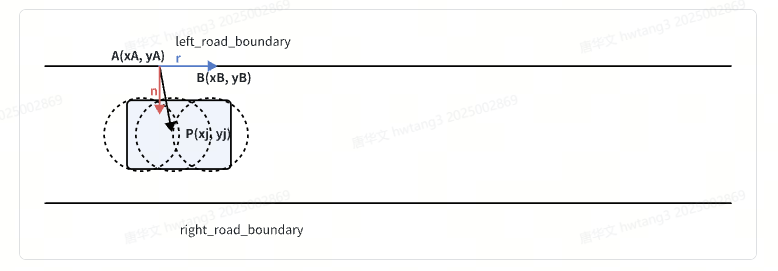

$ J_{boundary} = w \cdot (e^{d_{safe} - d + r_{ego}} - 1) \quad \text{when } d \lt d_{safe} + r_{ego}, \quad 0 \text{ otherwise} $

其中 $ r = \sqrt{(w/2)^2 + (L_{wb}/3)^2} $，分别对左右边界计算。自车和障碍物各自独立计算边界距离。

**自车**：查询点为前轴中心 $ (x + L_{wb}\cos\theta, y + L_{wb}\sin\theta) $ 和后轴中心 $ (x, y) $，取距离更近者。  
**障碍物**：对每个障碍物同样计算其前后中心到边界的距离，使用障碍物自身的 $ r_{obs} $ 作为覆盖圆半径。

**Jacobian/Hessian**：结构与三圆盘相同（指数障碍 + 距离梯度链式法则）。自车部分梯度写入 $ l_x $ 的 ego 状态分量，障碍物部分梯度写入 $ l_x $ 的对应障碍物状态分量。

> 权重随时域指数衰减：$ w(k) = w_0 \cdot e^{-0.1k} $
>

```cpp
void EgoRoadBoundaryCostTerm::CalculateBoundaryDistancesInfo(
    const ilqr_solver::State &x) {
  double ego_x = x[EGO_X];
  double ego_y = x[EGO_Y];
  double ego_theta = x[EGO_THETA];
  double ego_wheel_base = cost_config_ptr_->at(EGO_WHEEL_BASE);
  double safe_distance = cost_config_ptr_->at(ROAD_BOUNDARY_SAFE_DIST);
  double cos_theta = std::cos(ego_theta);
  double sin_theta = std::sin(ego_theta);
  double front_center_x = ego_x + ego_wheel_base * cos_theta;
  double front_center_y = ego_y + ego_wheel_base * sin_theta;
  planning::planning_math::Vec2d front_center(front_center_x, front_center_y);
  planning::planning_math::Vec2d rear_center(ego_x, ego_y);
  planning::planning_math::Vec2d front_nearest_left, front_nearest_right;
  planning::planning_math::Vec2d rear_nearest_left, rear_nearest_right;
  double front_dist_to_left =
      road_left_boundary_path_->DistanceTo(front_center, &front_nearest_left);
  double rear_dist_to_left =
      road_left_boundary_path_->DistanceTo(rear_center, &rear_nearest_left);
  double front_dist_to_right =
      road_right_boundary_path_->DistanceTo(front_center, &front_nearest_right);
  double rear_dist_to_right =
      road_right_boundary_path_->DistanceTo(rear_center, &rear_nearest_right);
  double front_dist_to_left_sq = front_dist_to_left * front_dist_to_left;
  double rear_dist_to_left_sq = rear_dist_to_left * rear_dist_to_left;
  double front_dist_to_right_sq = front_dist_to_right * front_dist_to_right;
  double rear_dist_to_right_sq = rear_dist_to_right * rear_dist_to_right;
  double dist_to_left = front_dist_to_left_sq < rear_dist_to_left_sq
                            ? front_dist_to_left
                            : rear_dist_to_left;
  double dist_to_right = front_dist_to_right_sq < rear_dist_to_right_sq
                             ? front_dist_to_right
                             : rear_dist_to_right;
  bool left_front_closer = front_dist_to_left_sq < rear_dist_to_left_sq;
  bool right_front_closer = front_dist_to_right_sq < rear_dist_to_right_sq;
  bool ego_left_valid = false;
  planning::planning_math::Vec2d ego_left_unit_vector(0, 0);
  double left_dx = 0.0, left_dy = 0.0, left_dist = 0.0;
  if (dist_to_left < safe_distance + cost_config_ptr_->at(EGO_WIDTH) / 2.0) {
    const auto &query_point = left_front_closer ? front_center : rear_center;
    const auto &nearest_point =
        left_front_closer ? front_nearest_left : rear_nearest_left;
    left_dx = query_point.x() - nearest_point.x();
    left_dy = query_point.y() - nearest_point.y();
    left_dist = std::sqrt(left_dx * left_dx + left_dy * left_dy);
    if (left_dist > kEps) {
      ego_left_unit_vector.set_x(left_dx / left_dist);
      ego_left_unit_vector.set_y(left_dy / left_dist);
    }
    ego_left_valid = left_dist > kEps;
  }
  bool ego_right_valid = false;
  planning::planning_math::Vec2d ego_right_unit_vector(0, 0);
  double right_dx = 0.0, right_dy = 0.0, right_dist = 0.0;
  if (dist_to_right < safe_distance + cost_config_ptr_->at(EGO_WIDTH) / 2.0) {
    const auto &query_point = right_front_closer ? front_center : rear_center;
    const auto &nearest_point =
        right_front_closer ? front_nearest_right : rear_nearest_right;
    right_dx = query_point.x() - nearest_point.x();
    right_dy = query_point.y() - nearest_point.y();
    right_dist = std::sqrt(right_dx * right_dx + right_dy * right_dy);
    if (right_dist > kEps) {
      ego_right_unit_vector.set_x(right_dx / right_dist);
      ego_right_unit_vector.set_y(right_dy / right_dist);
    }
    ego_right_valid = right_dist > kEps;
  }
  dist_result_.min_dist_to_left = dist_to_left;
  dist_result_.min_dist_to_right = dist_to_right;
  dist_result_.left_front_closer = left_front_closer;
  dist_result_.right_front_closer = right_front_closer;
  dist_result_.front_center = front_center;
  dist_result_.rear_center = rear_center;
  dist_result_.ego_left_valid = ego_left_valid;
  dist_result_.ego_left_unit_vector = ego_left_unit_vector;
  dist_result_.ego_left_dx = left_dx;
  dist_result_.ego_left_dy = left_dy;
  dist_result_.ego_left_dist = left_dist;
  dist_result_.ego_right_valid = ego_right_valid;
  dist_result_.ego_right_unit_vector = ego_right_unit_vector;
  dist_result_.ego_right_dx = right_dx;
  dist_result_.ego_right_dy = right_dy;
  dist_result_.ego_right_dist = right_dist;
}

double EgoRoadBoundaryCostTerm::GetCost(const ilqr_solver::State &x,
                                        const ilqr_solver::Control &u) {
  if (!road_left_boundary_path_ || !road_right_boundary_path_ ||
      !road_left_boundary_path_->KdtreeValid() ||
      !road_right_boundary_path_->KdtreeValid()) {
    return 0.0;
  }
  CalculateBoundaryDistancesInfo(x);
  double safe_distance = cost_config_ptr_->at(ROAD_BOUNDARY_SAFE_DIST);
  double weight = cost_config_ptr_->at(W_ROAD_BOUNDARY);
  double ego_half_width = cost_config_ptr_->at(EGO_WIDTH) / 2.0;
  double ego_third_wheel_base = cost_config_ptr_->at(EGO_WHEEL_BASE) / 3.0;
  double ego_radius = std::sqrt(ego_half_width * ego_half_width +
                                ego_third_wheel_base * ego_third_wheel_base);
  double cost = 0.0;
  if (dist_result_.min_dist_to_left < safe_distance + ego_radius) {
    double violation =
        safe_distance - dist_result_.min_dist_to_left + ego_radius;
    cost += weight * (std::exp(violation) - 1.0);
  }
  if (dist_result_.min_dist_to_right < safe_distance + ego_radius) {
    double violation =
        safe_distance - dist_result_.min_dist_to_right + ego_radius;
    cost += weight * (std::exp(violation) - 1.0);
  }
  return cost;
}

void EgoRoadBoundaryCostTerm::GetGradientHessian(
    const ilqr_solver::State &x, const ilqr_solver::Control &u,
    ilqr_solver::LxMT &lx, ilqr_solver::LuMT &lu, ilqr_solver::LxxMT &lxx,
    ilqr_solver::LxuMT &lxu, ilqr_solver::LuuMT &luu) {
  if (!road_left_boundary_path_ || !road_right_boundary_path_ ||
      !road_left_boundary_path_->KdtreeValid() ||
      !road_right_boundary_path_->KdtreeValid()) {
    return;
  }
  CalculateBoundaryDistancesInfo(x);
  double safe_distance = cost_config_ptr_->at(ROAD_BOUNDARY_SAFE_DIST);
  double weight = cost_config_ptr_->at(W_ROAD_BOUNDARY);
  double ego_theta = x[EGO_THETA];
  double ego_wheel_base = cost_config_ptr_->at(EGO_WHEEL_BASE);
  double ego_half_width = cost_config_ptr_->at(EGO_WIDTH) / 2.0;
  double ego_one_third_wheel_base = ego_wheel_base / 3.0;
  double ego_radius =
      std::sqrt(ego_half_width * ego_half_width +
                ego_one_third_wheel_base * ego_one_third_wheel_base);
  if (dist_result_.ego_left_valid &&
      dist_result_.min_dist_to_left < safe_distance + ego_radius) {
    double unit_x = dist_result_.ego_left_unit_vector.x();
    double unit_y = dist_result_.ego_left_unit_vector.y();
    double violation =
        safe_distance - dist_result_.min_dist_to_left + ego_radius;
    double dx_dego_x, dx_dego_y, dx_dego_theta;
    double dy_dego_x, dy_dego_y, dy_dego_theta;
    if (dist_result_.left_front_closer) {
      dx_dego_x = 1.0;
      dx_dego_y = 0.0;
      dx_dego_theta = -ego_wheel_base * std::sin(ego_theta);
      dy_dego_x = 0.0;
      dy_dego_y = 1.0;
      dy_dego_theta = ego_wheel_base * std::cos(ego_theta);
    } else {
      dx_dego_x = 1.0;
      dx_dego_y = 0.0;
      dx_dego_theta = 0.0;
      dy_dego_x = 0.0;
      dy_dego_y = 1.0;
      dy_dego_theta = 0.0;
    }
    double ddist_dego_x = unit_x * dx_dego_x + unit_y * dy_dego_x;
    double ddist_dego_y = unit_x * dx_dego_y + unit_y * dy_dego_y;
    double ddist_dego_theta = unit_x * dx_dego_theta + unit_y * dy_dego_theta;
    double gradient_coeff = -weight * std::exp(violation);
    lx(EGO_X) += gradient_coeff * ddist_dego_x;
    lx(EGO_Y) += gradient_coeff * ddist_dego_y;
    lx(EGO_THETA) += gradient_coeff * ddist_dego_theta;
    double rel_x = dist_result_.ego_left_dx;
    double rel_y = dist_result_.ego_left_dy;
    double rel_distance = dist_result_.ego_left_dist;
    if (rel_distance > kEps) {
      double D3 = rel_distance * rel_distance * rel_distance;
      double offset = dist_result_.left_front_closer ? ego_wheel_base : 0.0;
      double dunitx_dx = (rel_y * rel_y) / D3;
      double dunitx_dy = -(rel_x * rel_y) / D3;
      double dunitx_dtheta = (-offset * std::sin(ego_theta) * rel_y * rel_y -
                              offset * std::cos(ego_theta) * rel_x * rel_y) / D3;
      double dunity_dx = -(rel_x * rel_y) / D3;
      double dunity_dy = (rel_x * rel_x) / D3;
      double dunity_dtheta = (offset * std::sin(ego_theta) * rel_x * rel_y +
                              offset * std::cos(ego_theta) * rel_x * rel_x) / D3;
      double d2dist_dx2 = dunitx_dx;
      double d2dist_dy2 = dunity_dy;
      double d2dist_dxdy = dunitx_dy;
      double d2dist_dxdtheta = dunitx_dtheta;
      double d2dist_dydtheta = dunity_dtheta;
      double d2dist_dtheta2 = dunitx_dtheta * dx_dego_theta +
                              unit_x * (-offset * std::cos(ego_theta)) +
                              dunity_dtheta * dy_dego_theta +
                              unit_y * (-offset * std::sin(ego_theta));
      double hess_coeff = weight * std::exp(violation);
      lxx(EGO_X, EGO_X) +=
          hess_coeff * (ddist_dego_x * ddist_dego_x - d2dist_dx2);
      lxx(EGO_Y, EGO_Y) +=
          hess_coeff * (ddist_dego_y * ddist_dego_y - d2dist_dy2);
      lxx(EGO_THETA, EGO_THETA) +=
          hess_coeff *
          (ddist_dego_theta * ddist_dego_theta - d2dist_dtheta2);
      lxx(EGO_X, EGO_Y) +=
          hess_coeff * (ddist_dego_x * ddist_dego_y - d2dist_dxdy);
      lxx(EGO_Y, EGO_X) +=
          hess_coeff * (ddist_dego_y * ddist_dego_x - d2dist_dxdy);
      lxx(EGO_X, EGO_THETA) +=
          hess_coeff * (ddist_dego_x * ddist_dego_theta - d2dist_dxdtheta);
      lxx(EGO_THETA, EGO_X) +=
          hess_coeff * (ddist_dego_theta * ddist_dego_x - d2dist_dxdtheta);
      lxx(EGO_Y, EGO_THETA) +=
          hess_coeff * (ddist_dego_y * ddist_dego_theta - d2dist_dydtheta);
      lxx(EGO_THETA, EGO_Y) +=
          hess_coeff * (ddist_dego_theta * ddist_dego_y - d2dist_dydtheta);
    }
  }
  if (dist_result_.ego_right_valid &&
      dist_result_.min_dist_to_right < safe_distance + ego_radius) {
    double unit_x = dist_result_.ego_right_unit_vector.x();
    double unit_y = dist_result_.ego_right_unit_vector.y();
    double violation =
        safe_distance - dist_result_.min_dist_to_right + ego_radius;
    double dx_dego_x, dx_dego_y, dx_dego_theta;
    double dy_dego_x, dy_dego_y, dy_dego_theta;
    if (dist_result_.right_front_closer) {
      dx_dego_x = 1.0;
      dx_dego_y = 0.0;
      dx_dego_theta = -ego_wheel_base * std::sin(ego_theta);
      dy_dego_x = 0.0;
      dy_dego_y = 1.0;
      dy_dego_theta = ego_wheel_base * std::cos(ego_theta);
    } else {
      dx_dego_x = 1.0;
      dx_dego_y = 0.0;
      dx_dego_theta = 0.0;
      dy_dego_x = 0.0;
      dy_dego_y = 1.0;
      dy_dego_theta = 0.0;
    }
    double ddist_dego_x = unit_x * dx_dego_x + unit_y * dy_dego_x;
    double ddist_dego_y = unit_x * dx_dego_y + unit_y * dy_dego_y;
    double ddist_dego_theta = unit_x * dx_dego_theta + unit_y * dy_dego_theta;
    double gradient_coeff = -weight * std::exp(violation);
    lx(EGO_X) += gradient_coeff * ddist_dego_x;
    lx(EGO_Y) += gradient_coeff * ddist_dego_y;
    lx(EGO_THETA) += gradient_coeff * ddist_dego_theta;
    double rel_x = dist_result_.ego_right_dx;
    double rel_y = dist_result_.ego_right_dy;
    double rel_distance = dist_result_.ego_right_dist;
    if (rel_distance > kEps) {
      double D3 = rel_distance * rel_distance * rel_distance;
      double offset = dist_result_.right_front_closer ? ego_wheel_base : 0.0;
      double dunitx_dx = (rel_y * rel_y) / D3;
      double dunitx_dy = -(rel_x * rel_y) / D3;
      double dunitx_dtheta = (-offset * std::sin(ego_theta) * rel_y * rel_y -
                              offset * std::cos(ego_theta) * rel_x * rel_y) / D3;
      double dunity_dx = -(rel_x * rel_y) / D3;
      double dunity_dy = (rel_x * rel_x) / D3;
      double dunity_dtheta = (offset * std::sin(ego_theta) * rel_x * rel_y +
                              offset * std::cos(ego_theta) * rel_x * rel_x) / D3;
      double d2dist_dx2 = dunitx_dx;
      double d2dist_dy2 = dunity_dy;
      double d2dist_dxdy = dunitx_dy;
      double d2dist_dxdtheta = dunitx_dtheta;
      double d2dist_dydtheta = dunity_dtheta;
      double d2dist_dtheta2 = dunitx_dtheta * dx_dego_theta +
                              unit_x * (-offset * std::cos(ego_theta)) +
                              dunity_dtheta * dy_dego_theta +
                              unit_y * (-offset * std::sin(ego_theta));
      double hess_coeff = weight * std::exp(violation);
      lxx(EGO_X, EGO_X) +=
          hess_coeff * (ddist_dego_x * ddist_dego_x - d2dist_dx2);
      lxx(EGO_Y, EGO_Y) +=
          hess_coeff * (ddist_dego_y * ddist_dego_y - d2dist_dy2);
      lxx(EGO_THETA, EGO_THETA) +=
          hess_coeff *
          (ddist_dego_theta * ddist_dego_theta - d2dist_dtheta2);
      lxx(EGO_X, EGO_Y) +=
          hess_coeff * (ddist_dego_x * ddist_dego_y - d2dist_dxdy);
      lxx(EGO_Y, EGO_X) +=
          hess_coeff * (ddist_dego_y * ddist_dego_x - d2dist_dxdy);
      lxx(EGO_X, EGO_THETA) +=
          hess_coeff * (ddist_dego_x * ddist_dego_theta - d2dist_dxdtheta);
      lxx(EGO_THETA, EGO_X) +=
          hess_coeff * (ddist_dego_theta * ddist_dego_x - d2dist_dxdtheta);
      lxx(EGO_Y, EGO_THETA) +=
          hess_coeff * (ddist_dego_y * ddist_dego_theta - d2dist_dydtheta);
      lxx(EGO_THETA, EGO_Y) +=
          hess_coeff * (ddist_dego_theta * ddist_dego_y - d2dist_dydtheta);
    }
  }
}
```

---

###### 车道边界代价（LaneBoundaryCostTerm）
**目标**：约束自车不越过车道线边界（非路沿）。与道路边界代价结构相同，但约束的是车道线而非路沿。

**生效条件**：当自车横向模态为 LaneKeep 时生效，约束自车在当前车道内行驶。变道场景下该代价不生效（允许跨越车道线）。

**代价函数**（指数障碍函数）：

$ J_{lane} = w \cdot (e^{d_{safe} - d_{lane}} - 1) \quad \text{when } d_{lane} \lt d_{safe}, \quad 0 \text{ otherwise} $

其中 $ d_{lane} $ 为自车前/后中心点到左/右车道线的最近距离。

**Jacobian / Hessian**：与 RoadBoundaryCostTerm 完全相同，仅将道路边界替换为车道线边界。

> 道路边界（RoadBoundary）约束路沿/护栏等硬边界，权重大、不可越过；车道边界（LaneBoundary）约束车道线，权重相对较小，变道时可关闭。
>

```cpp
class EgoLaneBoundaryCostTerm : public ilqr_solver::BaseCostTerm {
 public:
  EgoLaneBoundaryCostTerm(
      std::shared_ptr<planning::planning_math::KDPath> lane_left,
      std::shared_ptr<planning::planning_math::KDPath> lane_right)
      : lane_left_boundary_path_(lane_left),
        lane_right_boundary_path_(lane_right) {}

  double GetCost(const ilqr_solver::State &x,
                 const ilqr_solver::Control &) override {
    CalculateLaneBoundaryDistances(x);

    const double weight = cost_config_ptr_->at(W_LANE_BOUNDARY);
    const double safe_dist = cost_config_ptr_->at(LANE_BOUNDARY_SAFE_DIST);
    double cost = 0.0;

    if (dist_result_.min_dist_to_left < safe_dist) {
      const double violation = safe_dist - dist_result_.min_dist_to_left;
      cost += weight * (std::exp(violation) - 1.0);
    }
    if (dist_result_.min_dist_to_right < safe_dist) {
      const double violation = safe_dist - dist_result_.min_dist_to_right;
      cost += weight * (std::exp(violation) - 1.0);
    }
    return cost;
  }

  void GetGradientHessian(const ilqr_solver::State &x,
                          const ilqr_solver::Control &, ilqr_solver::LxMT &lx,
                          ilqr_solver::LuMT &, ilqr_solver::LxxMT &lxx,
                          ilqr_solver::LxuMT &, ilqr_solver::LuuMT &) override {
    CalculateLaneBoundaryDistances(x);

    const double weight = cost_config_ptr_->at(W_LANE_BOUNDARY);
    const double safe_dist = cost_config_ptr_->at(LANE_BOUNDARY_SAFE_DIST);

    // 左车道线
    if (dist_result_.min_dist_to_left < safe_dist && dist_result_.left_valid) {
      const double violation = safe_dist - dist_result_.min_dist_to_left;
      const double exp_v = std::exp(violation);
      const auto &unit = dist_result_.left_unit_vector;

      // 梯度：只作用于自车 (x, y, theta)
      const double grad_x = -weight * exp_v * unit.x();
      const double grad_y = -weight * exp_v * unit.y();
      lx(EGO_X) += grad_x;
      lx(EGO_Y) += grad_y;

      // Hessian
      lxx(EGO_X, EGO_X) += weight * exp_v * unit.x() * unit.x();
      lxx(EGO_Y, EGO_Y) += weight * exp_v * unit.y() * unit.y();
      lxx(EGO_X, EGO_Y) += weight * exp_v * unit.x() * unit.y();
      lxx(EGO_Y, EGO_X) += weight * exp_v * unit.y() * unit.x();
    }

    // 右车道线（同理）
    if (dist_result_.min_dist_to_right < safe_dist && dist_result_.right_valid) {
      const double violation = safe_dist - dist_result_.min_dist_to_right;
      const double exp_v = std::exp(violation);
      const auto &unit = dist_result_.right_unit_vector;

      lx(EGO_X) += -weight * exp_v * unit.x();
      lx(EGO_Y) += -weight * exp_v * unit.y();

      lxx(EGO_X, EGO_X) += weight * exp_v * unit.x() * unit.x();
      lxx(EGO_Y, EGO_Y) += weight * exp_v * unit.y() * unit.y();
      lxx(EGO_X, EGO_Y) += weight * exp_v * unit.x() * unit.y();
      lxx(EGO_Y, EGO_X) += weight * exp_v * unit.y() * unit.x();
    }
  }

 private:
  struct LaneBoundaryDistResult {
    double min_dist_to_left;
    double min_dist_to_right;
    bool left_valid;
    planning::planning_math::Vec2d left_unit_vector;
    bool right_valid;
    planning::planning_math::Vec2d right_unit_vector;
  };

  void CalculateLaneBoundaryDistances(const ilqr_solver::State &x);

  std::shared_ptr<planning::planning_math::KDPath> lane_left_boundary_path_;
  std::shared_ptr<planning::planning_math::KDPath> lane_right_boundary_path_;
  LaneBoundaryDistResult dist_result_;
};
```

---

###### 舒适性代价(Comfort Cost）
**纵向加速度代价（AccCostTerm）**：$ J_{acc} = \frac{1}{2} w_a \cdot a^2 $

```cpp
double EgoAccCostTerm::GetCost(const ilqr_solver::State &x,
                               const ilqr_solver::Control &) {
  double ego_acc = x[EGO_ACC];
  double weight = cost_config_ptr_->at(W_EGO_ACC);
  return 0.5 * weight * ego_acc * ego_acc;
}

void EgoAccCostTerm::GetGradientHessian(
    const ilqr_solver::State &x, const ilqr_solver::Control &,
    ilqr_solver::LxMT &lx, ilqr_solver::LuMT &, ilqr_solver::LxxMT &lxx,
    ilqr_solver::LxuMT &, ilqr_solver::LuuMT &) {
  double ego_acc = x[EGO_ACC];
  double weight = cost_config_ptr_->at(W_EGO_ACC);

  lx(EGO_ACC) += weight * ego_acc;

  lxx(EGO_ACC, EGO_ACC) += weight;
}
```

**纵向加加速度代价（JerkCostTerm）**：$ J_{jerk} = \frac{1}{2} w_j \cdot j^2 $（$ j $ 为控制量）

```cpp
double EgoJerkCostTerm::GetCost(const ilqr_solver::State &x,
                                const ilqr_solver::Control &u) {
  double ego_jerk = u[EGO_JERK];
  double weight = cost_config_ptr_->at(W_EGO_JERK);
  return 0.5 * weight * ego_jerk * ego_jerk;
}

void EgoJerkCostTerm::GetGradientHessian(
    const ilqr_solver::State &x, const ilqr_solver::Control &u,
    ilqr_solver::LxMT &lx, ilqr_solver::LuMT &lu, ilqr_solver::LxxMT &lxx,
    ilqr_solver::LxuMT &, ilqr_solver::LuuMT &luu) {
  double ego_jerk = u[EGO_JERK];
  double weight = cost_config_ptr_->at(W_EGO_JERK);

  lu(EGO_JERK) += weight * ego_jerk;

  luu(EGO_JERK, EGO_JERK) += weight;
}
```

**横向加速度代价（LatAccCostTerm）**：

横向加速度 $ a_{lat} \approx K v^2 \delta $，惩罚：$ J_{lat\_acc} = \frac{1}{2} w \cdot K^2 v^4 \cdot \delta^2 $

Jacobian 含 $ \delta $ 和 $ v $ 的交叉项：$ \frac{\partial^2 J}{\partial \delta \partial v} = 4wK^2 v^3 \delta $

```cpp
double LatAccCostTerm::GetCost(const ilqr_solver::State &x,
                               const ilqr_solver::Control &) {
  const double delta = x[EGO_DELTA];
  const double vel = x[EGO_VEL];
  const double K = cost_config_ptr_->at(CURV_FACTOR);
  const double weight = cost_config_ptr_->at(W_LAT_ACC);
  // J = 0.5 * w * K^2 * v^4 * delta^2
  const double Kv2 = K * vel * vel;
  return 0.5 * weight * Kv2 * Kv2 * delta * delta;
}

void LatAccCostTerm::GetGradientHessian(
    const ilqr_solver::State &x, const ilqr_solver::Control &,
    ilqr_solver::LxMT &lx, ilqr_solver::LuMT &, ilqr_solver::LxxMT &lxx,
    ilqr_solver::LxuMT &, ilqr_solver::LuuMT &) {
  const double delta = x[EGO_DELTA];
  const double vel = x[EGO_VEL];
  const double K = cost_config_ptr_->at(CURV_FACTOR);
  const double weight = cost_config_ptr_->at(W_LAT_ACC);
  const double K2 = K * K;
  const double v2 = vel * vel;
  const double v3 = v2 * vel;
  const double v4 = v2 * v2;

  // dJ/d(delta) = w * K^2 * v^4 * delta
  lx(EGO_DELTA) += weight * K2 * v4 * delta;
  // dJ/d(v) = 2 * w * K^2 * v^3 * delta^2
  lx(EGO_VEL) += 2.0 * weight * K2 * v3 * delta * delta;

  // d2J/d(delta)^2 = w * K^2 * v^4
  lxx(EGO_DELTA, EGO_DELTA) += weight * K2 * v4;
  // d2J/d(v)^2 = 6 * w * K^2 * v^2 * delta^2
  lxx(EGO_VEL, EGO_VEL) += 6.0 * weight * K2 * v2 * delta * delta;
  // d2J/d(delta)d(v) = 4 * w * K^2 * v^3 * delta
  const double cross = 4.0 * weight * K2 * v3 * delta;
  lxx(EGO_DELTA, EGO_VEL) += cross;
  lxx(EGO_VEL, EGO_DELTA) += cross;
}
```

**横向加加速度代价（LatJerkCostTerm）**：

横向加加速度 $ j_{lat} \approx K v^2 \omega $，惩罚：$ J_{lat\_jerk} = \frac{1}{2} w \cdot K^2 v^4 \cdot \omega^2 $

Jacobian 含 $ \omega $ 和 $ v $ 的交叉项：$ \frac{\partial^2 J}{\partial \omega \partial v} = 4wK^2 v^3 \omega $

```cpp
double LatJerkCostTerm::GetCost(const ilqr_solver::State &x,
                                const ilqr_solver::Control &u) {
  const double omega = u[EGO_OMEGA];
  const double vel = x[EGO_VEL];
  const double K = cost_config_ptr_->at(CURV_FACTOR);
  const double weight = cost_config_ptr_->at(W_LAT_JERK);
  // J = 0.5 * w * K^2 * v^4 * omega^2
  const double Kv2 = K * vel * vel;
  return 0.5 * weight * Kv2 * Kv2 * omega * omega;
}

void LatJerkCostTerm::GetGradientHessian(
    const ilqr_solver::State &x, const ilqr_solver::Control &u,
    ilqr_solver::LxMT &lx, ilqr_solver::LuMT &lu, ilqr_solver::LxxMT &lxx,
    ilqr_solver::LxuMT &lxu, ilqr_solver::LuuMT &luu) {
  const double omega = u[EGO_OMEGA];
  const double vel = x[EGO_VEL];
  const double K = cost_config_ptr_->at(CURV_FACTOR);
  const double weight = cost_config_ptr_->at(W_LAT_JERK);
  const double K2 = K * K;
  const double v2 = vel * vel;
  const double v3 = v2 * vel;
  const double v4 = v2 * v2;

  // dJ/d(omega) = w * K^2 * v^4 * omega
  lu(EGO_OMEGA) += weight * K2 * v4 * omega;
  // dJ/d(v) = 2 * w * K^2 * v^3 * omega^2
  lx(EGO_VEL) += 2.0 * weight * K2 * v3 * omega * omega;

  // d2J/d(omega)^2 = w * K^2 * v^4
  luu(EGO_OMEGA, EGO_OMEGA) += weight * K2 * v4;
  // d2J/d(v)^2 = 6 * w * K^2 * v^2 * omega^2
  lxx(EGO_VEL, EGO_VEL) += 6.0 * weight * K2 * v2 * omega * omega;
  // d2J/d(omega)d(v) = 4 * w * K^2 * v^3 * omega
  const double cross = 4.0 * weight * K2 * v3 * omega;
  lxu(EGO_VEL, EGO_OMEGA) += cross;
}
```

---

###### 状态约束代价（State Bound Cost）
**加速度边界代价（AccBoundCostTerm）**：$ a \in [a_{min}, a_{max}] $，典型 $ [-5, 2] $ m/s²

$ J = w \cdot (\text{violation})^2, \quad \text{violation} = \max(a - a_{max}, a_{min} - a, 0) $

```cpp
double EgoAccBoundCostTerm::GetCost(const ilqr_solver::State &x,
                                    const ilqr_solver::Control &) {
  double ego_acc = x[EGO_ACC];
  double weight = cost_config_ptr_->at(W_EGO_ACC_BOUND);
  double acc_max = cost_config_ptr_->at(EGO_ACC_MAX);
  double acc_min = cost_config_ptr_->at(EGO_ACC_MIN);

  double cost = 0.0;

  if (ego_acc > acc_max) {
    double violation = ego_acc - acc_max;
    cost += weight * violation * violation;
  }

  if (ego_acc < acc_min) {
    double violation = acc_min - ego_acc;
    cost += weight * violation * violation;
  }

  return cost;
}

void EgoAccBoundCostTerm::GetGradientHessian(
    const ilqr_solver::State &x, const ilqr_solver::Control &,
    ilqr_solver::LxMT &lx, ilqr_solver::LuMT &, ilqr_solver::LxxMT &lxx,
    ilqr_solver::LxuMT &, ilqr_solver::LuuMT &) {
  double ego_acc = x[EGO_ACC];
  double weight = cost_config_ptr_->at(W_EGO_ACC_BOUND);
  double acc_max = cost_config_ptr_->at(EGO_ACC_MAX);
  double acc_min = cost_config_ptr_->at(EGO_ACC_MIN);

  if (ego_acc > acc_max) {
    double violation = ego_acc - acc_max;
    lx(EGO_ACC) += 2.0 * weight * violation;
    lxx(EGO_ACC, EGO_ACC) += 2.0 * weight;
  }

  if (ego_acc < acc_min) {
    double violation = acc_min - ego_acc;
    lx(EGO_ACC) -= 2.0 * weight * violation;
    lxx(EGO_ACC, EGO_ACC) += 2.0 * weight;
  }
}
```

**加加速度边界代价（JerkBoundCostTerm）**：$ j \in [j_{min}, j_{max}] $，典型 $ [-5, 6] $ m/s³

```cpp
double EgoJerkBoundCostTerm::GetCost(const ilqr_solver::State &,
                                     const ilqr_solver::Control &u) {
  double ego_jerk = u[EGO_JERK];
  double weight = cost_config_ptr_->at(W_EGO_JERK_BOUND);
  double jerk_max = cost_config_ptr_->at(EGO_JERK_MAX);
  double jerk_min = cost_config_ptr_->at(EGO_JERK_MIN);

  double cost = 0.0;

  if (ego_jerk > jerk_max) {
    double violation = ego_jerk - jerk_max;
    cost += weight * violation * violation;
  }

  if (ego_jerk < jerk_min) {
    double violation = jerk_min - ego_jerk;
    cost += weight * violation * violation;
  }

  return cost;
}

void EgoJerkBoundCostTerm::GetGradientHessian(
    const ilqr_solver::State &, const ilqr_solver::Control &u,
    ilqr_solver::LxMT &, ilqr_solver::LuMT &lu, ilqr_solver::LxxMT &,
    ilqr_solver::LxuMT &, ilqr_solver::LuuMT &luu) {
  double ego_jerk = u[EGO_JERK];
  double weight = cost_config_ptr_->at(W_EGO_JERK_BOUND);
  double jerk_max = cost_config_ptr_->at(EGO_JERK_MAX);
  double jerk_min = cost_config_ptr_->at(EGO_JERK_MIN);

  if (ego_jerk > jerk_max) {
    double violation = ego_jerk - jerk_max;
    lu(EGO_JERK) += 2.0 * weight * violation;
    luu(EGO_JERK, EGO_JERK) += 2.0 * weight;
  }

  if (ego_jerk < jerk_min) {
    double violation = jerk_min - ego_jerk;
    lu(EGO_JERK) -= 2.0 * weight * violation;
    luu(EGO_JERK, EGO_JERK) += 2.0 * weight;
  }
}
```

---

###### 纵向半平面约束代价（HalfplaneCostTerm）
**目标**：基于纵向决策标签（Overtake/Yield），约束自车与障碍物的纵向间距。自车和障碍物通过代价分配比例 $ \alpha $ 耦合。

**决策标签**：

+ Label=1（Overtake）：约束自车尾部与障碍物前端的纵向距离
+ Label=2（Yield）：约束障碍物尾部与自车前端的纵向距离

**软半平面代价（SoftHalfplaneCostTerm）**：

$ s_{current} = \Delta\vec{r} \cdot \hat{n}_{ego}, \quad s_{target} = s_0 + \tau \cdot v_{ref} $

$ J_{soft} = w \cdot (s_{current} - s_{target})^2 \quad \text{when } s_{current} \lt s_{target}, \quad 0 \text{ otherwise} $

**礼貌性系数（Politeness Coefficient）**：

半平面代价的梯度通过分配比例 $ \alpha $ 在自车和障碍物之间分配：

+ 自车承担 $ \alpha $ 比例的梯度，驱动自车主动调整
+ 障碍物承担 $ (1-\alpha) $ 比例的梯度，驱动障碍物预测轨迹被"推开"

$ \nabla J_{ego} = \alpha \cdot \nabla J_{halfplane}, \quad \nabla J_{obs} = (1-\alpha) \cdot \nabla J_{halfplane} $

**物理含义**：$ \alpha $ 本质上是博弈论中 Stackelberg leader-follower game 的礼貌性系数。在自车目标函数中引入 follower（障碍物）的代价项，通过调节 $ \alpha $ 控制自车的"利他程度"：

+ $ \alpha \to 1 $（selfish）：自车承担全部代价，主动避让障碍物，行为保守
+ $ \alpha \to 0 $（aggressive）：障碍物承担全部代价，自车不让步，行为激进
+ $ \alpha = 0.5 $（courteous）：双方均等分担，产生礼貌性交互行为

该设计源自 Stackelberg 博弈框架：leader（自车）在优化自身目标时，通过 $ \alpha $ 加权考虑 follower（障碍物）的代价，从而在效率与安全之间取得平衡。当碰撞风险代价主导时，纯 selfish 策略会导致过度保守（总是让行），引入礼貌性系数可以产生更自然的交互行为。

参考文献：Courteous Autonomous Cars [https://arxiv.org/abs/1808.02633](https://arxiv.org/abs/1808.02633)

```cpp
std::vector<SoftHalfplaneCostTerm::SoftHalfplaneResult>
SoftHalfplaneCostTerm::CalculateSoftHalfplane(const ilqr_solver::State &x) {
  std::vector<SoftHalfplaneResult> results;

  const int obs_num = cost_config_ptr_->at(OBS_NUM);
  if (obs_num == 0) {
    return results;
  }

  results.reserve(obs_num);

  const double ego_x = x[EGO_X];
  const double ego_y = x[EGO_Y];
  const double ego_theta = x[EGO_THETA];
  const double ego_vel = x[EGO_VEL];
  const double ego_length = cost_config_ptr_->at(EGO_LENGTH);
  const double ego_front_edge_to_rear_axle =
      cost_config_ptr_->at(EGO_FRONT_EDGE_TO_REAR_AXLE);
  const double ego_rear_edge_to_rear_axle =
      cost_config_ptr_->at(EGO_LENGTH) - ego_front_edge_to_rear_axle;

  const double s0 = cost_config_ptr_->at(SOFT_HALFPLANE_S0);
  const double tau = cost_config_ptr_->at(SOFT_HALFPLANE_TAU);
  
  const double ego_cos_theta = std::cos(ego_theta);
  const double ego_sin_theta = std::sin(ego_theta);

  for (int i = 0; i < obs_num; ++i) {
    const int label_idx = GetObsLongitudinalLabelIdx(i, obs_num);
    const int label_value = static_cast<int>(cost_config_ptr_->at(label_idx));

    if (label_value != 1 && label_value != 2) {
      continue;
    }

    // Get obstacle state from reference trajectory.
    const int ref_x_idx = GetObsRefStateIdx(i, obs_num, OBS_X);
    const int ref_y_idx = GetObsRefStateIdx(i, obs_num, OBS_Y);
    const int ref_theta_idx = GetObsRefStateIdx(i, obs_num, OBS_THETA);
    const int ref_vel_idx = GetObsRefStateIdx(i, obs_num, OBS_VEL);
    const double obs_x = cost_config_ptr_->at(ref_x_idx);
    const double obs_y = cost_config_ptr_->at(ref_y_idx);
    const double obs_theta = cost_config_ptr_->at(ref_theta_idx);
    const double obs_vel = cost_config_ptr_->at(ref_vel_idx);
    const double obs_length = cost_config_ptr_->at(GetObsLengthIdx(i, obs_num));

    const double obs_normal_x = std::cos(obs_theta);
    const double obs_normal_y = std::sin(obs_theta);

    double s_current = 0.0;
    double s_target = 0.0;
    double result_dx = 0.0;
    double result_dy = 0.0;
    double result_edge_offset = 0.0;

    if (label_value == 1) {
      const double ego_rear_x =
          ego_x - ego_rear_edge_to_rear_axle * ego_cos_theta;
      const double ego_rear_y =
          ego_y - ego_rear_edge_to_rear_axle * ego_sin_theta;

      const double obs_front_x = obs_x + (obs_length / 2.0) * obs_normal_x;
      const double obs_front_y = obs_y + (obs_length / 2.0) * obs_normal_y;

      const double dx = ego_rear_x - obs_front_x;
      const double dy = ego_rear_y - obs_front_y;

      s_current = dx * ego_cos_theta + dy * ego_sin_theta;

      if (s_current < 0) {
        continue;
      }

      s_target = s0 + tau * ego_vel;
      result_dx = dx;
      result_dy = dy;
      result_edge_offset = ego_rear_edge_to_rear_axle;

    } else if (label_value == 2) {
      const double ego_front_x =
          ego_x + ego_front_edge_to_rear_axle * ego_cos_theta;
      const double ego_front_y =
          ego_y + ego_front_edge_to_rear_axle * ego_sin_theta;

      const double obs_rear_x = obs_x - (obs_length / 2.0) * obs_normal_x;
      const double obs_rear_y = obs_y - (obs_length / 2.0) * obs_normal_y;

      const double dx = obs_rear_x - ego_front_x;
      const double dy = obs_rear_y - ego_front_y;

      s_current = dx * ego_cos_theta + dy * ego_sin_theta;

      if (s_current <= 0) {
        continue;
      }

      s_target = s0 + tau * obs_vel;
      result_dx = dx;
      result_dy = dy;
      result_edge_offset = ego_front_edge_to_rear_axle;
    }

    SoftHalfplaneResult result;
    result.obs_index = i;
    result.label_type = label_value;
    result.s_current = s_current;
    result.s_target = s_target;
    result.normal_x = ego_cos_theta;
    result.normal_y = ego_sin_theta;
    result.dx = result_dx;
    result.dy = result_dy;
    result.edge_offset = result_edge_offset;

    results.push_back(result);
  }

  return results;
}

double SoftHalfplaneCostTerm::GetCost(const ilqr_solver::State &x,
                                      const ilqr_solver::Control &u) {
  auto results = CalculateSoftHalfplane(x);

  if (results.empty()) {
    return 0.0;
  }

  const double weight = cost_config_ptr_->at(W_SOFT_HALFPLANE);
  constexpr double epsilon = 1e-3;
  double total_cost = 0.0;

  for (const auto &result : results) {
    const double violation = result.s_current - result.s_target;
    if (violation < -epsilon) {
      total_cost += weight * violation * violation;
    }
  }

  return total_cost;
}

void SoftHalfplaneCostTerm::GetGradientHessian(
    const ilqr_solver::State &x, const ilqr_solver::Control &u,
    ilqr_solver::LxMT &lx, ilqr_solver::LuMT &lu, ilqr_solver::LxxMT &lxx,
    ilqr_solver::LxuMT &lxu, ilqr_solver::LuuMT &luu) {
  auto results = CalculateSoftHalfplane(x);

  if (results.empty()) {
    return;
  }

  const double weight = cost_config_ptr_->at(W_SOFT_HALFPLANE);
  const double alpha =
      cost_config_ptr_->at(SOFT_HALFPLANE_COST_ALLOCATION_RATIO);
  const double tau = cost_config_ptr_->at(SOFT_HALFPLANE_TAU);
  constexpr double epsilon = 1e-3;

  for (const auto &result : results) {
    const double violation = result.s_current - result.s_target;
    if (violation >= -epsilon) {
      continue;
    }

    const int obs_idx = result.obs_index;
    const int label_type = result.label_type;
    const int state_base_idx = EGO_STATE_SIZE + obs_idx * OBS_STATE_SIZE;

    const double normal_x = result.normal_x;
    const double normal_y = result.normal_y;

    const double ego_weight = alpha;
    const double obs_weight = 1.0 - alpha;

    const double gradient_coeff = 2.0 * weight * violation;
    const double hess_coeff = 2.0 * weight;

    // ∂s/∂θ = -dx·sinθ + dy·cosθ
    const double ddist_dego_theta =
        -result.dx * normal_y + result.dy * normal_x;

    if (label_type == 1) {

      const double ddist_dego_x = normal_x;
      const double ddist_dego_y = normal_y;
      const double ddist_dego_vel = -tau;

      lx(EGO_X) += ego_weight * gradient_coeff * ddist_dego_x;
      lx(EGO_Y) += ego_weight * gradient_coeff * ddist_dego_y;
      lx(EGO_THETA) += ego_weight * gradient_coeff * ddist_dego_theta;
      lx(EGO_VEL) += ego_weight * gradient_coeff * ddist_dego_vel;

      lxx(EGO_X, EGO_X) +=
          ego_weight * hess_coeff * ddist_dego_x * ddist_dego_x;
      lxx(EGO_Y, EGO_Y) +=
          ego_weight * hess_coeff * ddist_dego_y * ddist_dego_y;
      lxx(EGO_THETA, EGO_THETA) +=
          ego_weight * hess_coeff * ddist_dego_theta * ddist_dego_theta;
      lxx(EGO_VEL, EGO_VEL) +=
          ego_weight * hess_coeff * ddist_dego_vel * ddist_dego_vel;
      lxx(EGO_X, EGO_Y) +=
          ego_weight * hess_coeff * ddist_dego_x * ddist_dego_y;
      lxx(EGO_Y, EGO_X) +=
          ego_weight * hess_coeff * ddist_dego_y * ddist_dego_x;
      lxx(EGO_X, EGO_THETA) +=
          ego_weight * hess_coeff * ddist_dego_x * ddist_dego_theta;
      lxx(EGO_THETA, EGO_X) +=
          ego_weight * hess_coeff * ddist_dego_theta * ddist_dego_x;
      lxx(EGO_Y, EGO_THETA) +=
          ego_weight * hess_coeff * ddist_dego_y * ddist_dego_theta;
      lxx(EGO_THETA, EGO_Y) +=
          ego_weight * hess_coeff * ddist_dego_theta * ddist_dego_y;
      lxx(EGO_X, EGO_VEL) +=
          ego_weight * hess_coeff * ddist_dego_x * ddist_dego_vel;
      lxx(EGO_VEL, EGO_X) +=
          ego_weight * hess_coeff * ddist_dego_vel * ddist_dego_x;
      lxx(EGO_Y, EGO_VEL) +=
          ego_weight * hess_coeff * ddist_dego_y * ddist_dego_vel;
      lxx(EGO_VEL, EGO_Y) +=
          ego_weight * hess_coeff * ddist_dego_vel * ddist_dego_y;
      lxx(EGO_THETA, EGO_VEL) +=
          ego_weight * hess_coeff * ddist_dego_theta * ddist_dego_vel;
      lxx(EGO_VEL, EGO_THETA) +=
          ego_weight * hess_coeff * ddist_dego_vel * ddist_dego_theta;

    } else if (label_type == 2) {

      const double ddist_dego_x = -normal_x;
      const double ddist_dego_y = -normal_y;

      lx(EGO_X) += ego_weight * gradient_coeff * ddist_dego_x;
      lx(EGO_Y) += ego_weight * gradient_coeff * ddist_dego_y;
      lx(EGO_THETA) += ego_weight * gradient_coeff * ddist_dego_theta;

      lxx(EGO_X, EGO_X) +=
          ego_weight * hess_coeff * ddist_dego_x * ddist_dego_x;
      lxx(EGO_Y, EGO_Y) +=
          ego_weight * hess_coeff * ddist_dego_y * ddist_dego_y;
      lxx(EGO_THETA, EGO_THETA) +=
          ego_weight * hess_coeff * ddist_dego_theta * ddist_dego_theta;
      lxx(EGO_X, EGO_Y) +=
          ego_weight * hess_coeff * ddist_dego_x * ddist_dego_y;
      lxx(EGO_Y, EGO_X) +=
          ego_weight * hess_coeff * ddist_dego_y * ddist_dego_x;
      lxx(EGO_X, EGO_THETA) +=
          ego_weight * hess_coeff * ddist_dego_x * ddist_dego_theta;
      lxx(EGO_THETA, EGO_X) +=
          ego_weight * hess_coeff * ddist_dego_theta * ddist_dego_x;
      lxx(EGO_Y, EGO_THETA) +=
          ego_weight * hess_coeff * ddist_dego_y * ddist_dego_theta;
      lxx(EGO_THETA, EGO_Y) +=
          ego_weight * hess_coeff * ddist_dego_theta * ddist_dego_y;

    }
  }
```

**硬半平面代价（HardHalfplaneCostTerm）**：

$ J_{hard} = w \cdot (s - d_{hard})^2 \quad \text{when } s \lt d_{hard}, \quad 0 \text{ otherwise} $

> 权重随时域指数衰减：$ w(k) = w_0 \cdot e^{-0.15k} $
>

```cpp
std::vector<HardHalfplaneCostTerm::HardHalfplaneResult>
HardHalfplaneCostTerm::CalculateObsHardHalfplane(const ilqr_solver::State &x) {
  std::vector<HardHalfplaneResult> results;

  const int obs_num = cost_config_ptr_->at(OBS_NUM);
  if (obs_num == 0) {
    return results;
  }

  results.reserve(obs_num);

  const double ego_x = x[EGO_X];
  const double ego_y = x[EGO_Y];
  const double ego_theta = x[EGO_THETA];
  const double ego_length = cost_config_ptr_->at(EGO_LENGTH);
  const double ego_front_edge_to_rear_axle =
      cost_config_ptr_->at(EGO_FRONT_EDGE_TO_REAR_AXLE);
  const double ego_rear_edge_to_rear_axle =
      cost_config_ptr_->at(EGO_LENGTH) - ego_front_edge_to_rear_axle;
  const double hard_dist = cost_config_ptr_->at(HARD_HALFPLANE_DIST);
  const double ego_cos_theta = std::cos(ego_theta);
  const double ego_sin_theta = std::sin(ego_theta);

  for (int i = 0; i < obs_num; ++i) {
    const int label_idx = GetObsLongitudinalLabelIdx(i, obs_num);
    const int label_value = static_cast<int>(cost_config_ptr_->at(label_idx));

    if (label_value != 1 && label_value != 2) {
      continue;
    }

    // Get obstacle state from reference trajectory.
    const int ref_x_idx = GetObsRefStateIdx(i, obs_num, OBS_X);
    const int ref_y_idx = GetObsRefStateIdx(i, obs_num, OBS_Y);
    const int ref_theta_idx = GetObsRefStateIdx(i, obs_num, OBS_THETA);
    const double obs_x = cost_config_ptr_->at(ref_x_idx);
    const double obs_y = cost_config_ptr_->at(ref_y_idx);
    const double obs_theta = cost_config_ptr_->at(ref_theta_idx);
    const double obs_length = cost_config_ptr_->at(GetObsLengthIdx(i, obs_num));

    const double obs_normal_x = std::cos(obs_theta);
    const double obs_normal_y = std::sin(obs_theta);

    double plane_dist = 0.0;
    double result_dx = 0.0;
    double result_dy = 0.0;
    double result_edge_offset = 0.0;

    if (label_value == 1) {
      const double ego_rear_x =
          ego_x - ego_rear_edge_to_rear_axle * ego_cos_theta;
      const double ego_rear_y =
          ego_y - ego_rear_edge_to_rear_axle * ego_sin_theta;

      const double obs_front_x = obs_x + (obs_length / 2.0) * obs_normal_x;
      const double obs_front_y = obs_y + (obs_length / 2.0) * obs_normal_y;

      const double dx = ego_rear_x - obs_front_x;
      const double dy = ego_rear_y - obs_front_y;

      const double dist_along_ego_heading =
          dx * ego_cos_theta + dy * ego_sin_theta;

      if (dist_along_ego_heading < 0) {
        continue;
      }

      plane_dist = dist_along_ego_heading - hard_dist;
      result_dx = dx;
      result_dy = dy;
      result_edge_offset = ego_rear_edge_to_rear_axle;

    } else if (label_value == 2) {
      const double ego_front_x =
          ego_x + ego_front_edge_to_rear_axle * ego_cos_theta;
      const double ego_front_y =
          ego_y + ego_front_edge_to_rear_axle * ego_sin_theta;

      const double obs_rear_x = obs_x - (obs_length / 2.0) * obs_normal_x;
      const double obs_rear_y = obs_y - (obs_length / 2.0) * obs_normal_y;

      const double dx = obs_rear_x - ego_front_x;
      const double dy = obs_rear_y - ego_front_y;

      const double dist_along_ego_heading =
          dx * ego_cos_theta + dy * ego_sin_theta;

      if (dist_along_ego_heading <= 0) {
        continue;
      }

      plane_dist = dist_along_ego_heading - hard_dist;
      result_dx = dx;
      result_dy = dy;
      result_edge_offset = ego_front_edge_to_rear_axle;
    }

    HardHalfplaneResult result;
    result.obs_index = i;
    result.label_type = label_value;
    result.plane_dist = plane_dist;
    result.normal_x = ego_cos_theta;
    result.normal_y = ego_sin_theta;
    result.dx = result_dx;
    result.dy = result_dy;
    result.edge_offset = result_edge_offset;

    results.push_back(result);
  }

  return results;
}

double HardHalfplaneCostTerm::GetCost(const ilqr_solver::State &x,
                                      const ilqr_solver::Control &u) {
  auto results = CalculateObsHardHalfplane(x);

  if (results.empty()) {
    return 0.0;
  }

  const double weight = cost_config_ptr_->at(W_HARD_HALFPLANE);
  constexpr double epsilon = 1e-3;
  double total_cost = 0.0;

  for (const auto &result : results) {
    if (result.plane_dist < -epsilon) {
      const double violation = result.plane_dist;
      total_cost += weight * violation * violation;
    }
  }

  return total_cost;
}

void HardHalfplaneCostTerm::GetGradientHessian(
    const ilqr_solver::State &x, const ilqr_solver::Control &u,
    ilqr_solver::LxMT &lx, ilqr_solver::LuMT &lu, ilqr_solver::LxxMT &lxx,
    ilqr_solver::LxuMT &lxu, ilqr_solver::LuuMT &luu) {
  auto results = CalculateObsHardHalfplane(x);

  if (results.empty()) {
    return;
  }

  const double weight = cost_config_ptr_->at(W_HARD_HALFPLANE);
  const double alpha = cost_config_ptr_->at(HALFPLANE_COST_ALLOCATION_RATIO);
  constexpr double epsilon = 1e-3;

  for (const auto &result : results) {
    if (result.plane_dist >= -epsilon) {
      continue;
    }

    const int obs_idx = result.obs_index;
    const int label_type = result.label_type;
    const int state_base_idx = EGO_STATE_SIZE + obs_idx * OBS_STATE_SIZE;

    const double violation = result.plane_dist;
    const double normal_x = result.normal_x;
    const double normal_y = result.normal_y;

    const double ego_weight = alpha;
    const double obs_weight = 1.0 - alpha;

    const double gradient_coeff = 2.0 * weight * violation;
    const double hess_coeff = 2.0 * weight;

    // ∂s/∂θ = -dx·sinθ + dy·cosθ
    const double ddist_dego_theta =
        -result.dx * normal_y + result.dy * normal_x;

    if (label_type == 1) {
      const double ddist_dego_x = normal_x;
      const double ddist_dego_y = normal_y;

      lx(EGO_X) += ego_weight * gradient_coeff * ddist_dego_x;
      lx(EGO_Y) += ego_weight * gradient_coeff * ddist_dego_y;
      lx(EGO_THETA) += ego_weight * gradient_coeff * ddist_dego_theta;

      lxx(EGO_X, EGO_X) +=
          ego_weight * hess_coeff * ddist_dego_x * ddist_dego_x;
      lxx(EGO_Y, EGO_Y) +=
          ego_weight * hess_coeff * ddist_dego_y * ddist_dego_y;
      lxx(EGO_THETA, EGO_THETA) +=
          ego_weight * hess_coeff * ddist_dego_theta * ddist_dego_theta;
      lxx(EGO_X, EGO_Y) +=
          ego_weight * hess_coeff * ddist_dego_x * ddist_dego_y;
      lxx(EGO_Y, EGO_X) +=
          ego_weight * hess_coeff * ddist_dego_y * ddist_dego_x;
      lxx(EGO_X, EGO_THETA) +=
          ego_weight * hess_coeff * ddist_dego_x * ddist_dego_theta;
      lxx(EGO_THETA, EGO_X) +=
          ego_weight * hess_coeff * ddist_dego_theta * ddist_dego_x;
      lxx(EGO_Y, EGO_THETA) +=
          ego_weight * hess_coeff * ddist_dego_y * ddist_dego_theta;
      lxx(EGO_THETA, EGO_Y) +=
          ego_weight * hess_coeff * ddist_dego_theta * ddist_dego_y;

      // 障碍物侧梯度 (Overtake): ∂s/∂obs = -ego_normal
      const int obs_x_idx = GetObsStateIdx(obs_idx, OBS_X);
      const int obs_y_idx = GetObsStateIdx(obs_idx, OBS_Y);
      lx(obs_x_idx) += obs_weight * gradient_coeff * (-normal_x);
      lx(obs_y_idx) += obs_weight * gradient_coeff * (-normal_y);
      lxx(obs_x_idx, obs_x_idx) += obs_weight * hess_coeff * normal_x * normal_x;
      lxx(obs_y_idx, obs_y_idx) += obs_weight * hess_coeff * normal_y * normal_y;
      lxx(obs_x_idx, obs_y_idx) += obs_weight * hess_coeff * normal_x * normal_y;
      lxx(obs_y_idx, obs_x_idx) += obs_weight * hess_coeff * normal_y * normal_x;

    } else if (label_type == 2) {
      const double ddist_dego_x = -normal_x;
      const double ddist_dego_y = -normal_y;

      lx(EGO_X) += ego_weight * gradient_coeff * ddist_dego_x;
      lx(EGO_Y) += ego_weight * gradient_coeff * ddist_dego_y;
      lx(EGO_THETA) += ego_weight * gradient_coeff * ddist_dego_theta;

      lxx(EGO_X, EGO_X) +=
          ego_weight * hess_coeff * ddist_dego_x * ddist_dego_x;
      lxx(EGO_Y, EGO_Y) +=
          ego_weight * hess_coeff * ddist_dego_y * ddist_dego_y;
      lxx(EGO_THETA, EGO_THETA) +=
          ego_weight * hess_coeff * ddist_dego_theta * ddist_dego_theta;
      lxx(EGO_X, EGO_Y) +=
          ego_weight * hess_coeff * ddist_dego_x * ddist_dego_y;
      lxx(EGO_Y, EGO_X) +=
          ego_weight * hess_coeff * ddist_dego_y * ddist_dego_x;
      lxx(EGO_X, EGO_THETA) +=
          ego_weight * hess_coeff * ddist_dego_x * ddist_dego_theta;
      lxx(EGO_THETA, EGO_X) +=
          ego_weight * hess_coeff * ddist_dego_theta * ddist_dego_x;
      lxx(EGO_Y, EGO_THETA) +=
          ego_weight * hess_coeff * ddist_dego_y * ddist_dego_theta;
      lxx(EGO_THETA, EGO_Y) +=
          ego_weight * hess_coeff * ddist_dego_theta * ddist_dego_y;

      // 障碍物侧梯度 (Yield): ∂s/∂obs = ego_normal
      const int obs_x_idx = GetObsStateIdx(obs_idx, OBS_X);
      const int obs_y_idx = GetObsStateIdx(obs_idx, OBS_Y);
      lx(obs_x_idx) += obs_weight * gradient_coeff * normal_x;
      lx(obs_y_idx) += obs_weight * gradient_coeff * normal_y;
      lxx(obs_x_idx, obs_x_idx) += obs_weight * hess_coeff * normal_x * normal_x;
      lxx(obs_y_idx, obs_y_idx) += obs_weight * hess_coeff * normal_y * normal_y;
      lxx(obs_x_idx, obs_y_idx) += obs_weight * hess_coeff * normal_x * normal_y;
      lxx(obs_y_idx, obs_x_idx) += obs_weight * hess_coeff * normal_y * normal_x;
    }
  }
}
```


##### ⑤ 优化问题求解
iLQR 是面向非线性确定性系统的有限时域最优控制算法，核心是通过迭代对非线性动力学做一阶线性化、对代价函数做二次近似，将复杂的非线性最优控制问题拆解为一系列可解析求解的时变 LQR 子问题，最终收敛到局部最优的状态-控制轨迹。


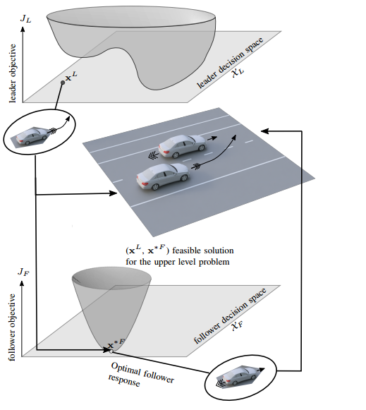

###### 标准定义
离散非线性系统，被控对象满足以下状态转移方程：

$ x_{t+1} = f(x_t, u_t) $

+ $ x_t \in \mathbb{R}^n $：$ t $ 时刻的系统状态向量
+ $ u_t \in \mathbb{R}^m $：$ t $ 时刻的控制向量
+ $ f(\cdot) $：非线性状态转移函数
+ $ t = 0,1,\ldots,T-1 $：离散时间步

优化目标：找到最优控制序列 $ U^* = \{u_0^*,u_1^*,\ldots,u_{T-1}^*\} $，使有限时域内总代价最小：

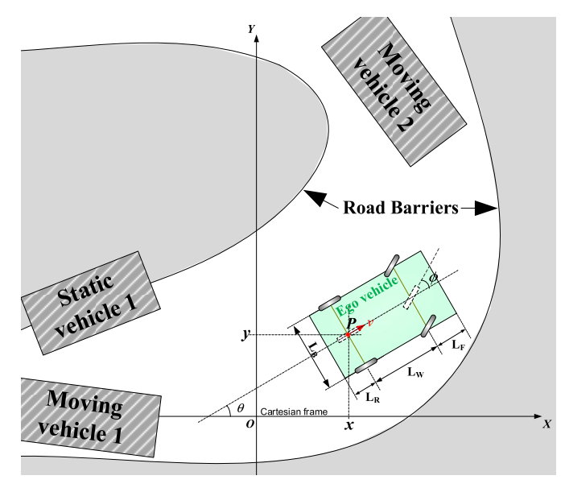

$ J(\tau) = \phi(x_T) + \sum_{t=0}^{T-1} l(x_t, u_t) $

+ $ \tau = \{x_0, u_0, \ldots, x_{T-1}, u_{T-1}, x_T\} $：状态-控制轨迹
+ $ \phi(x_T) $：终端代价
+ $ l(x_t, u_t) $：运行代价

###### 求解流程
iLQR 求解分为五个步骤：初始化标称轨迹、沿标称轨迹局部近似、反向递推（Backward Pass）、前向滚动（Forward Pass）、收敛判断。

对应代码主循环（`ilqr_core.cpp`）：

```cpp
bool iLqr::iLqrIteration() {
  lambda_ = 0.0;
  lambda_gain_ = 1.0;

  for (size_t iter = 0; iter < solver_config_ptr_->max_iter; ++iter) {
    if (update_success) {
      UpdateDynamicsDerivatives();  // 计算 fx, fu, lx, lu, lxx, luu, lxu
    }

    // STEP 1: backward pass
    while (true) {
      const bool is_converged = BackwardPass();
      if (is_converged) break;
      if (lambda_ > lambda_max) return false;
      IncreaseLambda();
    }

    // STEP 2: forward pass (line search)
    const bool forward_pass_success = ForwardPass(new_cost, expected, iter);
    const double dcost = cost_ - new_cost;

    // STEP 3: convergence check
    if (forward_pass_success) {
      DecreaseLambda();
      cost_ = new_cost;
      if (dcost < cost_tol) break;  // 收敛
    } else {
      IncreaseLambda();
      if (lambda_ > lambda_max) break;
    }
  }
}
```

**步骤1：初始化标称轨迹**

设定初始控制序列 $ U^0 $（通常为零控制或上一帧 warm-start），从初始状态 $ x_0 $ 前向仿真得到标称轨迹 $ \{x_0, x_1, \ldots, x_T\} $。

**步骤2：沿标称轨迹局部近似**

非线性状态方程一阶线性化：

$ \delta x_{t+1} = A_t \delta x_t + B_t \delta u_t $

其中 $ A_t = \frac{\partial f}{\partial x}\big|_{\bar{x}_t, \bar{u}_t} $，$ B_t = \frac{\partial f}{\partial u}\big|_{\bar{x}_t, \bar{u}_t} $ 分别为状态雅可比和控制雅可比。

代价函数二阶近似（忽略常数项）：

$ \Delta J = \phi_x^T \delta x_T + \frac{1}{2} \delta x_T^T \phi_{xx} \delta x_T + \sum_{t=0}^{T-1}\left(l_x^T \delta x_t + l_u^T \delta u_t + \frac{1}{2} \delta x_t^T l_{xx} \delta x_t + \delta x_t^T l_{xu} \delta u_t + \frac{1}{2} \delta u_t^T l_{uu} \delta u_t\right) $

对应代码（`UpdateDynamicsDerivatives`）：

```cpp
void iLqr::UpdateDynamicsDerivatives() {
  for (size_t i = 0; i < horizon + 1; ++i) {
    lx_vec_[i].setZero(); lu_vec_[i].setZero();
    lxx_vec_[i].setZero(); lxu_vec_[i].setZero(); luu_vec_[i].setZero();

    if (i < horizon) {
      ilqr_model_ptr_->GetDynamicsDerivatives(xk_vec_[i], uk_vec_[i],
                                              fx_vec_[i], fu_vec_[i], i);
      ilqr_model_ptr_->GetGradientHessian(xk_vec_[i], uk_vec_[i], i,
                                          lx_vec_[i], lu_vec_[i],
                                          lxx_vec_[i], lxu_vec_[i], luu_vec_[i]);
    } else {
      ilqr_model_ptr_->GetTerminalGradientHessian(xk_vec_[i], lx_vec_[i],
                                                  lu_vec_[i], lxx_vec_[i],
                                                  lxu_vec_[i], luu_vec_[i]);
    }
  }
}
```

**步骤3：反向递推（Backward Pass）**

基于贝尔曼最优性原理，从终端 $ T $ 倒推至 $ t=0 $，求解最优控制律的反馈增益 $ K_t $ 和前馈项 $ k_t $。

定义值函数 $ V_t(x_t) = \min_{u_t,\ldots,u_{T-1}}\left[\phi(x_T) + \sum_{k=t}^{T-1} l(x_k, u_k)\right] $，由贝尔曼方程：

$ V_t(x_t) = \min_{u_t}\left[l(x_t, u_t) + V_{t+1}(x_{t+1})\right] = \min_{u_t} Q_t(x_t, u_t) $

将 Q 函数在标称点二阶展开，得到系数：

$ \begin{cases} Q_x = l_x + A_t^T V_{x,t+1} \\ Q_u = l_u + B_t^T V_{x,t+1} \\ Q_{xx} = l_{xx} + A_t^T V_{xx,t+1} A_t \\ Q_{uu} = l_{uu} + B_t^T V_{xx,t+1} B_t \\ Q_{ux} = l_{xu}^T + B_t^T V_{xx,t+1} A_t \end{cases} $

令 $ \frac{\partial Q}{\partial \delta u} = 0 $，求得最优控制增量：

$ \delta u_t^* = K_t \delta x_t + k_t, \quad K_t = -Q_{uu}^{-1} Q_{ux}, \quad k_t = -Q_{uu}^{-1} Q_u $

值函数参数递推：

$ V_{x,t} = Q_x + K_t^T Q_{uu} k_t + K_t^T Q_u + Q_{ux}^T k_t $

$ V_{xx,t} = Q_{xx} + K_t^T Q_{uu} K_t + K_t^T Q_{ux} + Q_{ux}^T K_t $

对应代码：

```cpp
bool iLqr::BackwardPass() {
  Eigen::MatrixXd Vx = lx_vec_[horizon];   // 终端代价梯度
  Eigen::MatrixXd Vxx = lxx_vec_[horizon];  // 终端代价 Hessian
  dV_.fill(0);

  for (int i = horizon - 1; i >= 0; i--) {
    const Eigen::MatrixXd fut = fu_vec_[i].transpose();
    const Eigen::MatrixXd fxt = fx_vec_[i].transpose();
    const Eigen::MatrixXd fu_Vxx = fut * Vxx;

    Qx_ = lx_vec_[i] + fxt * Vx;
    Qu_ = lu_vec_[i] + fut * Vx;
    Qxx_ = lxx_vec_[i] + fxt * Vxx * fx_vec_[i];
    Quu_ = luu_vec_[i] + fu_Vxx * fu_vec_[i];
    Qux_ = lxu_vec_[i].transpose() + fu_Vxx * fx_vec_[i];

    // 正则化保证 Quu 正定
    Quuf_ = Quu_ + lambda_ * I;
    if (!PSDCheck(Quuf_)) return false;

    // 求解前馈和反馈增益
    const Eigen::MatrixXd QuuF_inv = Quuf_.inverse();
    k_vec_[i] = -QuuF_inv * Qu_;
    K_vec_[i] = -QuuF_inv * Qux_;

    // 递推值函数
    dV_[0] += k_vec_[i].transpose() * Qu_;
    dV_[1] += 0.5 * k_vec_[i].transpose() * Quu_ * k_vec_[i];

    Vx = Qx_ + (K_vec_[i].transpose() * Quu_ + Qux_.transpose()) * k_vec_[i]
         + K_vec_[i].transpose() * Qu_;
    Vxx = Qxx_ + (K_vec_[i].transpose() * Quu_ + Qux_.transpose()) * K_vec_[i]
          + K_vec_[i].transpose() * Qux_;
  }
  return true;
}
```

**步骤4：前向滚动（Forward Pass）**

利用反向递推得到的控制律，通过原始非线性动力学更新轨迹，并通过线搜索保证代价单调下降：

+ 计算状态偏差：$ \delta x_t = x_{new,t} - \bar{x}_t $
+ 更新控制：$ u_{new,t} = \bar{u}_t + \alpha k_t + K_t \delta x_t $
+ 前向积分：$ x_{new,t+1} = f(x_{new,t}, u_{new,t}) $
+ 累加代价：$ J_{new} = \sum_t l(x_{new,t}, u_{new,t}) + \phi(x_{new,T}) $

线搜索接受准则：期望代价下降 $ \Delta V_{exp} = -\alpha(dV_0 + \alpha \cdot dV_1) $，当实际下降与期望下降之比超过阈值 $ z_{min} $ 时接受。

对应代码：

```cpp
bool iLqr::ForwardPass(double &new_cost, double &expected, const size_t &iter) {
  for (size_t i = 0; i < alpha_vec.size(); ++i) {
    alpha = alpha_vec[i];
    new_cost = 0.0;

    for (size_t t = 0; t < horizon; ++t) {
      const auto du = alpha * k_vec_[t] + K_vec_[t] * (xk_new_vec_[t] - xk_vec_[t]);
      uk_new_vec_[t] = uk_vec_[t] + du;

      new_cost += GetCost(xk_new_vec_[t], uk_new_vec_[t], t);
      xk_new_vec_[t + 1] = UpdateDynamicsOneStep(xk_new_vec_[t], uk_new_vec_[t], t);
    }
    new_cost += GetTerminalCost(xk_new_vec_[horizon]);

    expected = -alpha * (dV_[0] + alpha * dV_[1]);
    if (expected >= 0.0 && (cost_ - new_cost) / expected > z_min) {
      // 接受新轨迹
      xk_vec_ = xk_new_vec_;
      uk_vec_ = uk_new_vec_;
      return true;
    }
  }
  return false;
}
```

**步骤5：收敛判断**

+ 正常收敛：代价下降 $ \Delta J &lt; \epsilon_{cost} $
+ 控制量收敛：$ \|du\| &lt; \epsilon_{du} $
+ 正则化溢出：$ \lambda &gt; \lambda_{max} $（线搜索失败）

正则化参数 $ \lambda $ 管理策略：

+ Backward Pass 失败（$ Q_{uu} $ 非正定）→ 增大 $ \lambda $
+ Forward Pass 成功 → 减小 $ \lambda $
+ Forward Pass 失败 → 增大 $ \lambda $

```cpp
void iLqr::IncreaseLambda() {
  lambda_gain_ = max(lambda_factor, lambda_gain_ * lambda_factor);
  lambda_ = max(lambda_start, lambda_ * lambda_gain_);
}
void iLqr::DecreaseLambda() {
  lambda_gain_ = min(1.0 / lambda_factor, lambda_gain_ / lambda_factor);
  lambda_ = lambda_ * lambda_gain_;
}
```

##### ⑥ 策略评估与选择
每个候选场景经 iLQR 联合优化后产生一条自车轨迹，策略评估模块对所有场景的优化轨迹进行多维度打分，选出最优场景执行。

###### 代价评估
$ J_{total} = w_s \cdot f_s + w_e \cdot f_e + w_n \cdot f_n + w_c \cdot f_c + w_m \cdot f_m $

+ $ f_s $：安全代价 — 轨迹碰撞风险
+ $ f_e $：效率代价 — 速度偏差
+ $ f_n $：导航代价 — 到目标车道的横向距离
+ $ f_c $：舒适性代价 — 轨迹平顺性
+ $ f_m $：模型代价 — 与模型置信分数的偏差

权重：$ w_s = 10.0, \; w_e = 15.0, \; w_n = 12.0, \; w_c = 8.0, \; w_m = 5.0 $

选择逻辑：

$ \pi^* = \arg\min_{\pi \in \Pi_{valid}} J_{total}(\pi) $

+ 过滤无效场景（碰撞、目标车道不匹配）
+ 选取 $ J_{total} $ 最小的场景
+ 输出该场景的自车优化轨迹，送入控制器执行

###### 安全代价（Safety Cost）
逐时间步检测 ego_box 与 obs_box 是否重叠，若碰撞则**直接淘汰该场景**（不参与后续评分）。

无碰撞时，基于 RSS 模型计算安全速度偏差：

对前方障碍物，求解自车安全上界速度 $ v_{ego}^{upp} $：

$ \frac{1}{2a_{brake,min}} v^2 + (t_{resp} + \frac{a_{max} \cdot t_{resp}}{a_{brake,min}}) v + c = 0 $

$ c = \frac{1}{2}(a_{max} + \frac{a_{max}^2}{a_{brake,min}}) t_{resp}^2 - d_{obs,brake} - d_{lon} $

对后方障碍物（变道场景），求解安全下界速度：

$ v_{ego}^{low} = \sqrt{2 \cdot a_{brake,max} \cdot (d_{obs,driven} - d_{lon})} $

时间加权代价（总时域 5s，分段点 3s）：

$ f_s = 1 - e^{-(\sum_t w_t c_t)^2 / \sigma_s^2}, \quad \sigma_s = 150 $

$ w_t = \begin{cases} 2.0 & t \leq 3s \\ 1.0 & t \gt 3s \end{cases} $

+ 超速风险：$ c_t = w_t \cdot e^{0.15 |v_{ego} - v_{rss}^{upp}|} $
+ 欠速风险：$ c_t = w_t \cdot e^{0.20 |v_{ego} - v_{rss}^{low}|} $

###### 效率代价（Efficiency Cost）
$ f_e = \frac{\sum_t c_t^2}{\sum_t c_t}, \quad c_t = \min\left(1.0, \; 1.5 \cdot \frac{|v_t - v_{limit}|}{v_{limit}} \cdot k_{exceed}\right), \; k_{exceed}=1.7 $

+ $ v_t $：轨迹各时间步的速度
+ $ v_{limit} $：当前限速
+ 超速时 $ k_{exceed} = 1.7 $ 放大惩罚，低速时 $ k_{exceed} = 1.0 $

###### 导航代价（Navigation Cost）
基于候选场景目标车道与导航期望车道之间的**横向拓扑距离**（neighbor_idx，即相隔车道数）计算：

$ f_n = \alpha_{level} \cdot n_{lane} $

+ $ n_{lane} $：候选场景目标车道与导航期望车道之间的车道数（0 = 已在目标车道）
+ $ \alpha_{level} $：根据偏航紧迫程度分级的系数

| 状态 | 触发条件 | $ \alpha_{level} $ |
| --- | --- | --- |
| 无约束 | 偏航距离 > 1000m | 0（不施加导航惩罚） |
| 软约束 | 偏航距离 < 1000m | 0.2 |
| 硬约束 | 偏航时间 < 10s 或距离 < 250m | 0.5 |
| 强制 | 偏航时间 < 5s | 1.0 |


**拨杆变道**：拨杆信号将导航期望车道设为拨杆方向的相邻车道。代价计算方式不变 — 当前车道因 $ n_{lane} = 1 $ 产生导航代价，拨杆方向车道 $ n_{lane} = 0 $ 代价为零。若拨杆方向不安全（碰撞淘汰），当前车道仍可被选中。

###### 舒适性代价（Comfort Cost）
复用联合优化中的舒适性 cost 设计，评估优化轨迹的横纵向动力学平顺性。参考 nuPlan ego_is_comfortable 指标体系，从乘客体感维度评分：

**纵向舒适性**（对应 EgoAccCostTerm + EgoJerkCostTerm）：

$ f_c^{lon} = \frac{1}{N} \sum_{t=0}^{N-1} \left( \left(\frac{a_t}{a_{max}}\right)^2 + \left(\frac{j_t}{j_{max}}\right)^2 \right) $

+ $ a_t $：纵向加速度（状态量）
+ $ j_t = u_{jerk} $：纵向加加速度（控制量）

**横向舒适性**：

横向加速度和横摆角速度由运动学模型导出：

$ a_{lat,t} = K \cdot v_t^2 \cdot \delta_t, \quad \dot{\theta}_t = K \cdot v_t \cdot \delta_t $

$ f_c^{lat} = \frac{1}{N} \sum_{t=0}^{N-1} \left( \left(\frac{a_{lat,t}}{a_{lat,max}}\right)^2 + \left(\frac{\dot{\theta}_t}{\dot{\theta}_{max}}\right)^2 \right) $

**综合舒适性代价**：

$ f_c = f_c^{lon} + f_c^{lat} $

归一化后映射至 [0, 1]。参考 nuPlan comfort 指标阈值：

| 指标 | 舒适阈值 | 来源 |
| --- | --- | --- |
| 纵向加速度 | 加速 $ \leq 2.40 \; m/s^2 $，制动 $ \geq -4.05 \; m/s^2 $ | nuPlan |
| 纵向 jerk | $ \leq 4.13 \; m/s^3 $ | nuPlan |
| 合成 jerk | $ \leq 8.37 \; m/s^3 $ | nuPlan |
| 横向加速度 | $ \leq 4.89 \; m/s^2 $ | nuPlan |
| 横摆角速度 | $ \leq 0.95 \; rad/s $ | nuPlan |
| 横摆角加速度 | $ \leq 1.93 \; rad/s^2 $ | nuPlan |


超出阈值的时间步产生更高代价，确保优化轨迹在舒适性维度上可区分。

###### 模型代价（Model Cost）
模型输出每条横向模态轨迹的置信分数 $ \pi_0^{(i)} $（Score MLP），反映模型对该场景的综合评估。策略评估将模型分数作为先验，与规则代价互补：

$ f_m = 1 - \pi_0^{(i)} $

即模型置信度越高的场景，模型代价越低。该项的作用：

+ 当规则代价无法区分多个场景时（如安全/效率/导航代价接近），模型分数作为 tiebreaker 选出模型认为更优的场景
+ 当规则代价明确指向某个场景时（如某场景碰撞），规则代价主导，模型分数不会覆盖安全判断
+ 权重 $ w_m $ 设置为较低值（5.0），确保模型分数是辅助而非主导

> 设计原则：规则代价保安全下界，模型分数提供场景泛化性。两者加权结合，避免纯规则的过度保守和纯模型的安全盲区。
>

参考文献：

+ [1] Interactive Joint Planning for Autonomous Vehicles [https://arxiv.org/abs/2310.18301](https://arxiv.org/abs/2310.18301)
+ [2] Contingency Games for Multi-Agent Interaction [https://arxiv.org/abs/2304.05483](https://arxiv.org/abs/2304.05483)
+ [3] Optimal Vehicle Trajectory Planning for Static Obstacle Avoidance using Nonlinear Optimization [https://arxiv.org/abs/2307.09466](https://arxiv.org/abs/2307.09466)

##### ⑦ 实车效果
非规则路口直行：


路口左转：

大曲率弯道：


侧方车避让：


拨杆变道：

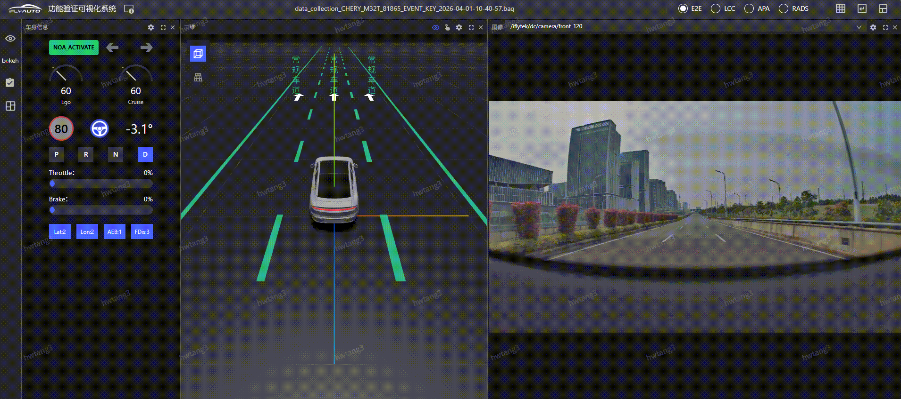

避让施工区域：


效率变道：


上匝道：

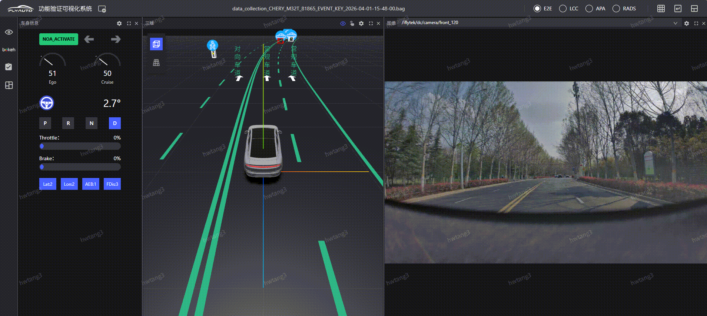

下匝道（有车）：


下匝道（无车）：

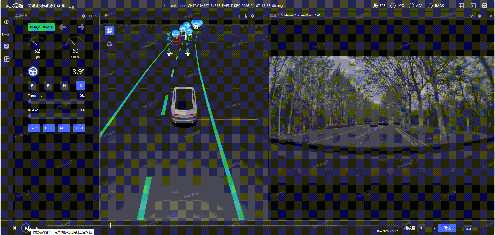

汇入主路（无车）：

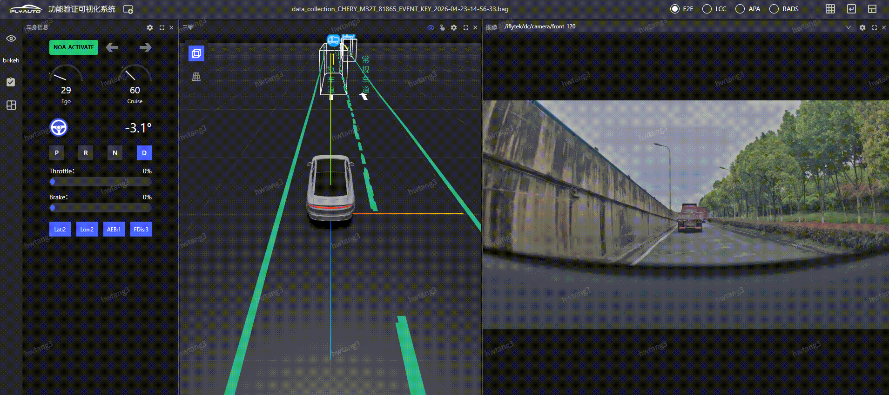

汇入主路（有车）：

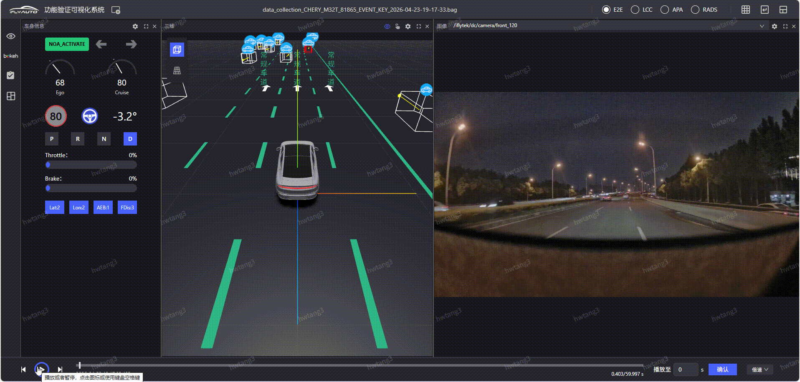

